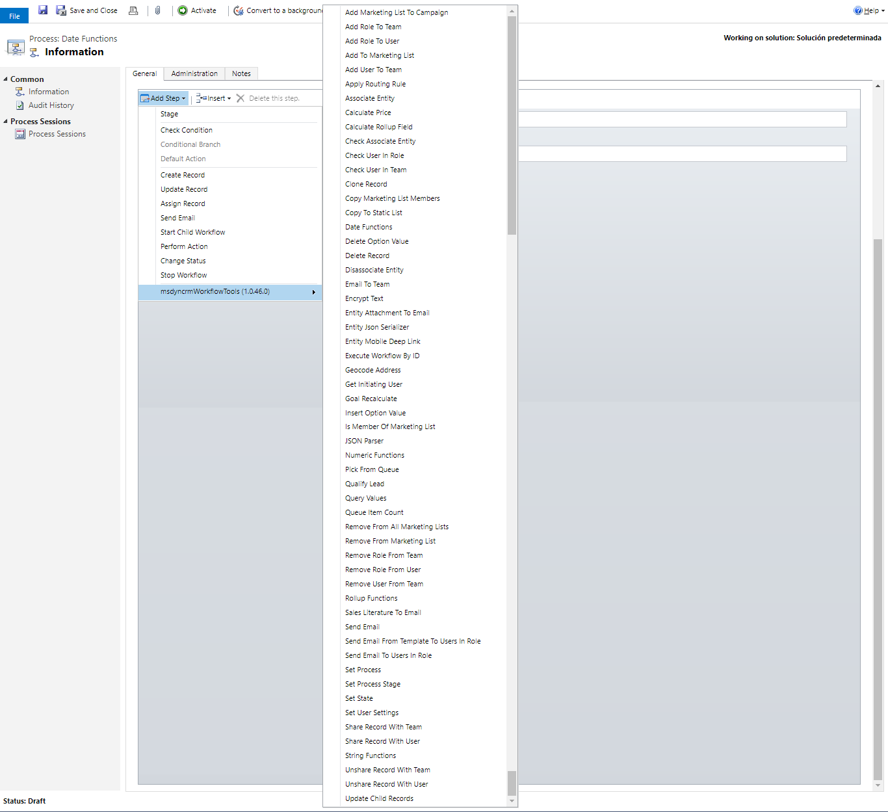

# Dynamics-365-Workflow-Tools
This Solution includes one Assembly that contains Tools based on Workflow Activities.
You must import this solution, to use it.

To import the Solution follow these steps:

* Download the ZIP file from the Releases tab (https://github.com/demianrasko/Dynamics-365-Workflow-Tools/releases)
 Access to the Dynamics 365 (CRM) environment and navigate to Settings>Solutions
* Click on Import and select the ZIP file
* Follow the wizzard steps

To see how to use each of the tools includes in this solution, please access to the following links:
* 1: [Force Calculate Rollup Field](/docs/Force%20Calculate%20Rollup%20Field.md)
* 2: [Apply Routing Rules](/docs/Apply%20Routing%20Rules.md)
* 3: [Query Values Step](/docs/Query%20Values%20Step.md)
* 4: [Share Record With Team](/docs/Share%20Record%20With%20Team.md)
* 5: [Share Record With User](/docs/Share%20Record%20With%20User.md)
* 6: [Unshare Record With Team](/docs/Unshare%20Record%20With%20Team.md)
* 7: [Unshare Record With User](/docs/Unshare%20Record%20With%20User.md)
* 8: [Check If User is in Role](/docs/Check%20If%20User%20is%20in%20Role.md)
* 9: [Check If User is in Team](/docs/Check%20If%20User%20is%20in%20Team.md)
* 10: [Add To Marketing List](/docs/Add%20To%20Marketing%20List.md)
* 11: [Remove From Marketing List](/docs/Remove%20From%20Marketing%20List.md)
* 12: [Clone Record](/docs/Clone%20Record.md)
* 13: [Set Process](/docs/Set%20Process.md)
* 14: [Rollup Functions](/docs/Rollup%20Functions.md)
* 15: [Entity Attachment To Email](/docs/Entity%20Attachment%20To%20Email.md)
* 16: [Pick From Queue](/docs/Pick%20From%20Queue.md)
* 17: [Queue Item Count](/docs/Queue%20Item%20Count.md)
* 18: [Add Role To User](/docs/Add%20Role%20To%20User.md)
* 19: [Add Role To Team](/docs/Add%20Role%20To%20Team.md)
* 20: [Remove Role From User](/docs/Remove%20Role%20From%20User.md)
* 21: [Remove Role From Team](/docs/Remove%20Role%20From%20Team.md)
* 22: [Set User Settings](/docs/Set%20User%20Settings.md)
* 23: [String Functions](/docs/String%20Functions.md)
* 24: [Delete Record](/docs/Delete%20Record.md)
* 25: [Entity Json Serializer](/docs/Entity%20Json%20Serializer.md)
* 26: [Qualify Lead](/docs/Qualify%20Lead.md)
* 27: [Add Marketing List To Campaign](/docs/Add%20Marketing%20List%20To%20Campaign.md)
* 28: [Copy Marketing List Members](/docs/Copy%20Marketing%20List%20Members.md)
* 29: [Copy To Static List](/docs/Copy%20To%20Static%20List.md)
* 30: [Is Member Of Marketing List](/docs/Is%20Member%20Of%20Marketing%20List.md)
* 31: [Remove From All Marketing Lists](/docs/Remove%20From%20All%20Marketing%20Lists.md)
* 32: [Numeric Functions](/docs/Numeric%20Functions.md)
* 33: [Email To Team](/docs/Email%20To%20Team.md)
* 34: [Set Process Stage](/docs/Set%20Process%20Stage.md)
* 35: [Entity Mobile Deep Link](/docs/Entity%20Mobile%20Deep%20Link.md)
* 36: [Send Email](/docs/Send%20Email.md)
* 37: [Geocode Address](/docs/Geocode%20Address.md)
* 38: [Add User To Team](/docs/Add%20User%20To%20Team.md)
* 39: [Remove User From Team](/docs/Remove%20User%20From%20Team.md)
* 40: [Associate Entity](/docs/Associate%20Entity.md)
* 41: [Goal Recalculate](/docs/Goal%20Recalculate.md)
* 42: [Get Initiating User](/docs/Get%20Initiating%20User.md)
* 43: [Encrypt Text](/docs/Encrypt%20Text.md)
* 44: [Check Associate Entity](/docs/Check%20Associate%20Entity.md)
* 45: [Set State](/docs/Set%20State.md)
* 46: [Update Child Records](/docs/Update%20Child%20Records.md)
* 47: [Disassociate Entity](/docs/Disassociate%20Entity.md)
* 48: [Insert Option Value](/docs/Insert%20Option%20Value.md)
* 49: [Delete Option Value](/docs/Delete%20Option%20Value.md)
* 50: [Sales Literature To Email](/docs/Sales%20Literature%20To%20Email.md)
* 51: [Send Email From Template To Users In Role](/docs/SendEmailFromTemplateToUsersInRole.md)
* 52: [Send Email To Users In Role](/docs/SendEmailToUsersInRole.md)
* 53: [Calculate Price](/docs/CalculatePrice.md)
* 54: [Execute Workflow By ID](/docs/ExecuteWorkflowByID.md)
* 55: [JSON Parser](/docs/JSONParser.md)
* 56: [Date Functions](/docs/DateFunctions.md)

