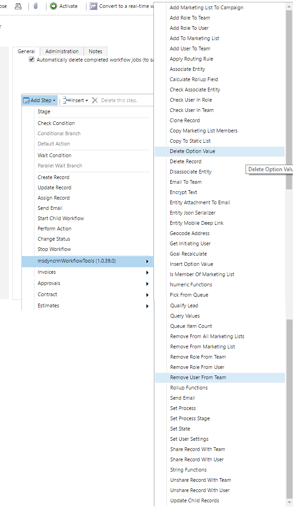

# Dynamics-365-Workflow-Tools
This Solution includes one Assembly that contains Tools based on Workflow Activities.
You must import this solution, to use it.

To import the Solution follow these steps:

# Download the ZIP file from the DOWNLOADS tab
# Access to the Dynamics CRM environment and navigate to Settings>Solutions
# Click on Import and select the ZIP file
# Follow the wizzard steps

To see how to use each of the tools includes in this solution, please access to the following links:
* [Force Calculate Rollup Field](/docs/Force%20Calculate%20Rollup%20Field.md)
* [Apply Routing Rules](/docs/Apply%20Routing%20Rules)
* [Query Values Step](/docs/Query%20Values%20Step)
* [Share Record With Team](/docs/Share%20Record%20With%20Team)
* [Share Record With User](/docs/Share%20Record%20With%20User)
* [Unshare Record With Team](/docs/Unshare%20Record%20With%20Team)
* [Unshare Record With User](/docs/Unshare%20Record%20With%20User)
* [Check If User is in Role](/docs/Check%20If%20User%20is%20in%20Role)
* [Check If User is in Team](/docs/Check%20If%20User%20is%20in%20Team)
* [Add To Marketing List](/docs/Add%20To%20Marketing%20List)
* [Remove From Marketing List](/docs/Remove%20From%20Marketing%20List)
* [Clone Record](/docs/Clone%20Record)
* [Set Process](/docs/Set%20Process)
* [Rollup Functions](/docs/Rollup%20Functions)
* [Entity Attachment To Email](/docs/Entity%20Attachment%20To%20Email)
* [Pick From Queue](/docs/Pick%20From%20Queue)
* [Queue Item Count](/docs/Queue%20Item%20Count)
* [Add Role To User](/docs/Add%20Role%20To%20User)
* [Add Role To Team](/docs/Add%20Role%20To%20Team)
* [Remove Role From User](/docs/Remove%20Role%20From%20User)
* [Remove Role From Team](/docs/Remove%20Role%20From%20Team)
* [Set User Settings](/docs/Set%20User%20Settings)
* [String Functions](/docs/String%20Functions)
* [Delete Record](/docs/Delete%20Record)
* [Entity Json Serializer](/docs/Entity%20Json%20Serializer)
* [Qualify Lead](/docs/Qualify%20Lead)
* [Add Marketing List To Campaign](/docs/Add%20Marketing%20List%20To%20Campaign)
* [Copy Marketing List Members](/docs/Copy%20Marketing%20List%20Members)
* [Copy To Static List](/docs/Copy%20To%20Static%20List)
* [Is Member Of Marketing List](/docs/Is%20Member%20Of%20Marketing%20List)
* [Remove From All Marketing Lists](/docs/Remove%20From%20All%20Marketing%20Lists)
* [Numeric Functions](/docs/Numeric%20Functions)
* [Email To Team](/docs/Email%20To%20Team)
* [Set Process Stage](/docs/Set%20Process%20Stage)
* [Entity Mobile Deep Link](/docs/Entity%20Mobile%20Deep%20Link)
* [Send Email](/docs/Send%20Email)
* [Geocode Address](/docs/Geocode%20Address)
* [Add User To Team](/docs/Add%20User%20To%20Team)
* [Remove User From Team](/docs/Remove%20User%20From%20Team)
* [Associate Entity](/docs/Associate%20Entity)
* [Goal Recalculate](/docs/Goal%20Recalculate)
* [Get Initiating User](/docs/Get%20Initiating%20User)
* [Encrypt Text](/docs/Encrypt%20Text)
* [Check Associate Entity](/docs/Check%20Associate%20Entity)
* [Set State](/docs/Set%20State)
* [Update Child Records](/docs/Update%20Child%20Records)
* [Disassociate Entity](/docs/Disassociate%20Entity)
* [Insert Option Value](/docs/Insert%20Option%20Value)

