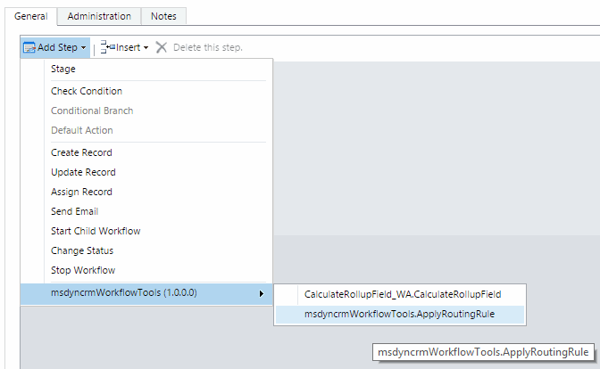
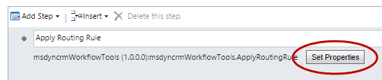
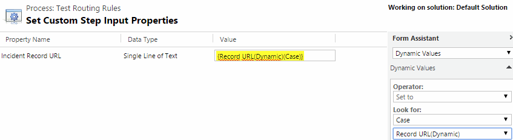

This Solution helps to execute the Routing Rule Sets for Cases. 
These Rules only executes right now when:
# On Email to Case Creation rules
# On Case views/forms, from the Command bar manually

With this Workflow Activity, you can execute the active Routing Rule for one record, on Workflows.

**NOTE**: Right now there is an issue with the ApplyRoutingRuleRequest message used in some versions. It was solved in the CRM 2013 SP1 UR2.

For use this in Workflows here are the steps:

Note: The  Record URL, is a standard feature of Dynamics CRM, taht contains the full URL of a record. In this URL you have the entity type, and the record GUID. Right now this is the only way we have to pass a "Dynamic" EntityReference (with not hard coding an entity type) to Workflows Activities. If you pass this string URL as a parameter, in the Workflow Activity you can retrieve this entity Reference.
