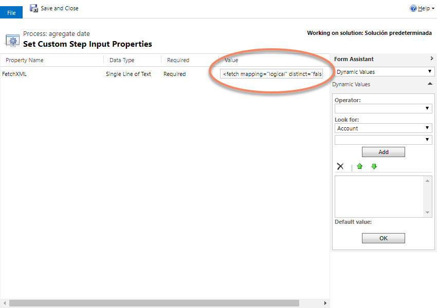
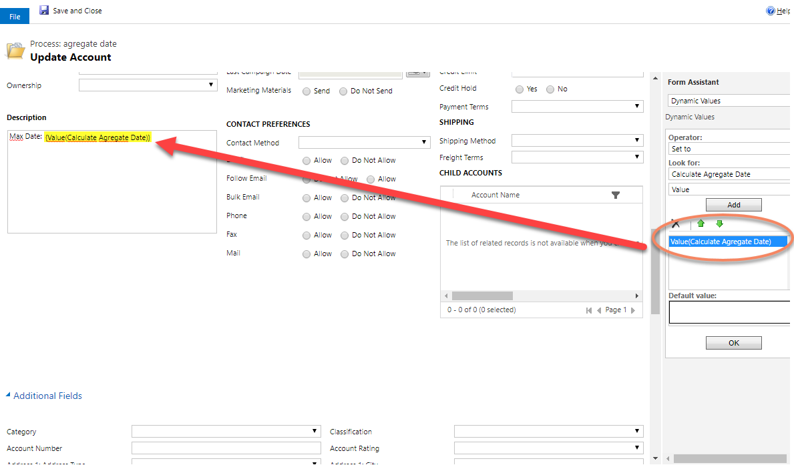
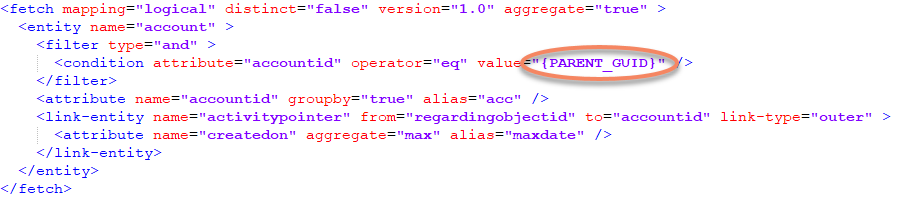

This Action allows you to execute a dynamic FetchXML with date agregation and return the result date.
Very usefull for example to retrieve the max/min date from child records from a customer.

First, you need to select the action:

![](CalculateAgregateDate1.png

Then, you complete the FetchXML:

And finnaly you can use the response on the workflow like this:

An example of the fetchXML to retrieve the max date of the related activities of the account:

Note that the {PARENT_GUID} text will be replaced dynamically with the entity context Guid.
