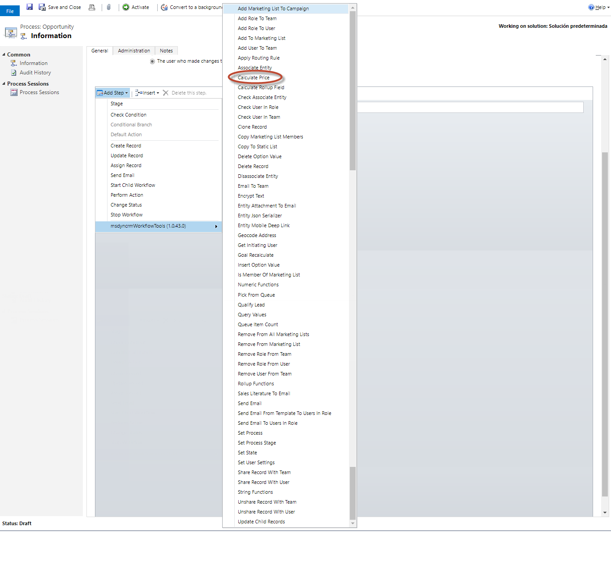
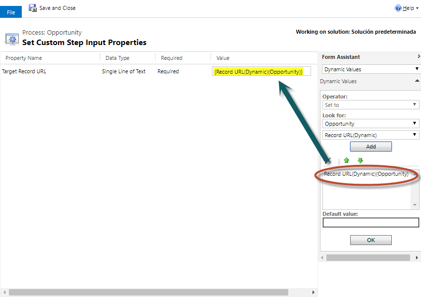

This step allows you to execute the custom CalculatePrice to entities like Opportunity, Quote, Order and Invoice. 
First, you need to disable the OOBPriceCalculationEnabled parameter on System setting (System pricing calculation to No).
Second, you cand develop your own Plugin to make your pricing calculations, as explained in the SDK: https://msdn.microsoft.com/en-us/library/dn817877.aspx

For using this activity you must access here and select Calculate Price action:

Then in the activity you can fill the parameters with the URL of the record:

