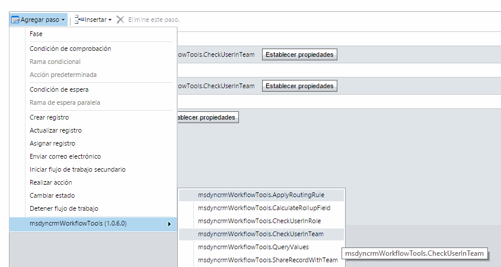
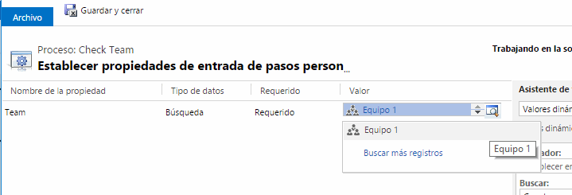
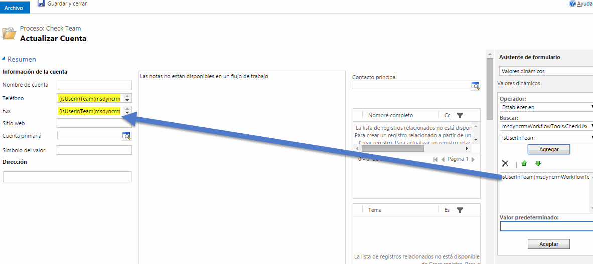

This step is very usefull to check if the user that initialized the Workflow execution, is a mamber of a specified Team.

For using this activity you mus access here and select CheckUserInTeam:

Then, you must select the Team you want to check:

The full params description is:
* **Team (required)** : the Team to be searched
* **IsUserInRole** : boolean with the result  

After that you can use the result on your fields:

