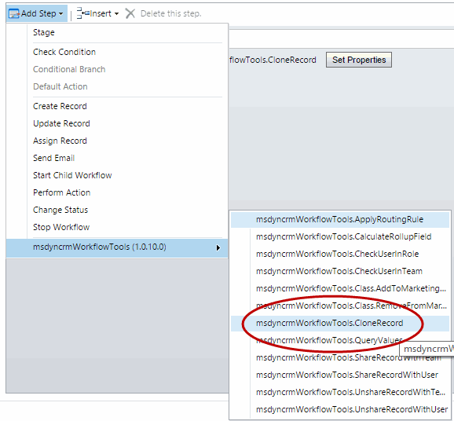
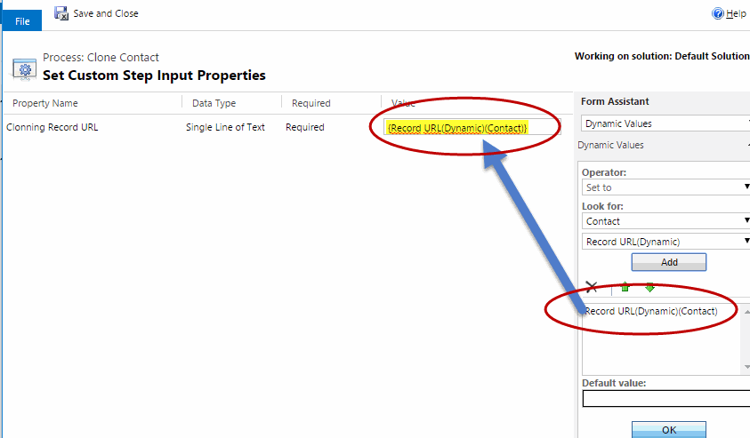

This step is very usefull to Clone some record. You pass the URL of one record, and it will create a new record, with the same values.

For using this activity you mus access here and select Clone Record:

Then, you must select the record URL(dynamic) field from the entity you want to clone as follows:

The full params description is:
* **Clonning Record URL (required)** : the URL of the record you want to clone

Note: The Parent Record URL, is a standard feature of Dynamics CRM, taht contains the full URL of a record. In this URL you have the entity type, and the record GUID. Right now this is the only way we have to pass a "Dynamic" EntityReference (with not hard coding an entity type) to Workflows Activities. If you pass this string URL as a parameter, in the Workflow Activity you can retrieve this entity Reference.
