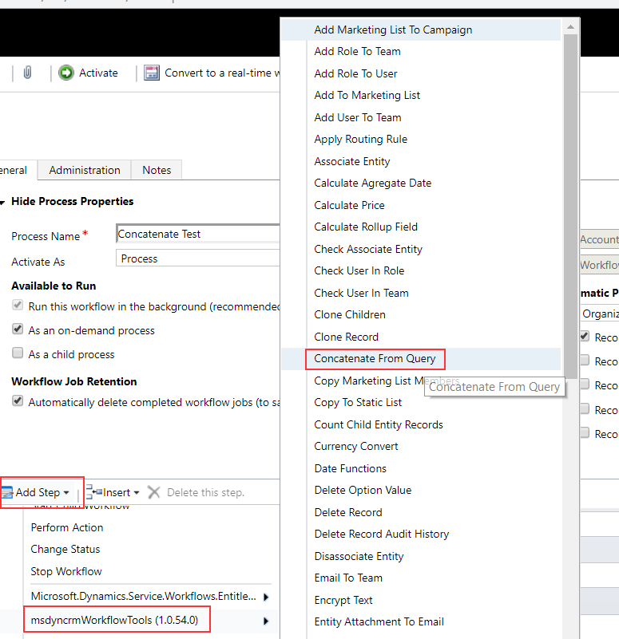
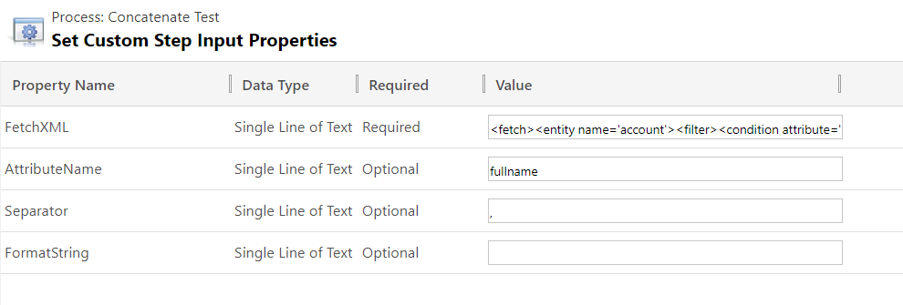

This step is useful to populate a field on a record using a query. The most useful case is when you need to show some details from child records on the parent (an example would be, if you need to show names of opportunities on an account).

For using this activity you must access here and select Concatenate from Query:




Parameters


The full params description is:
* **FetchXML (required)** : The FetchXML Query. Specify the parent record ID in the fetch using the following template: {PARENT_GUID}. **{PARENT_GUID}** will be replaced at run time with the ID of the entity that triggered the workflow.

Example FetchXML (this is just an example to show how one can pull data from child records, though this could have been directly against the contact entity):
```
<fetch>
  <entity name='account' >
	<filter>
	  <condition attribute='accountid' operator='eq' value='{PARENT_GUID}' />
	</filter>
	<link-entity name='contact' from='parentcustomerid' to='accountid' >
	  <attribute name='fullname' alias='contactFullName' />
	</link-entity>
  </entity>
</fetch>
```

* **AttributeName (Optional)** : The name of the attribute to concatenate. If one is not specified, then it will attempt to use the first field returned by the query. The best practice is to define the alias for the attribute in your query and use it in this field. In the example above, you would use **contactFullName** for this param.

* **Separator (Optional)** : When not defined, it will use ", ". If you want to use a different separator, define it here. Add a trailing space if you need it. 

* **Format (Optional)** : The format only if you need a special format. Used for numbers or dates. It uses the C# string format specification. As examples:
dd-MM-yyyy for dates or
$#,##0.00 for money.

* **Output parameter: ConcatenatedString** : the concatenated string that can be used in steps that follow this workflow step.
