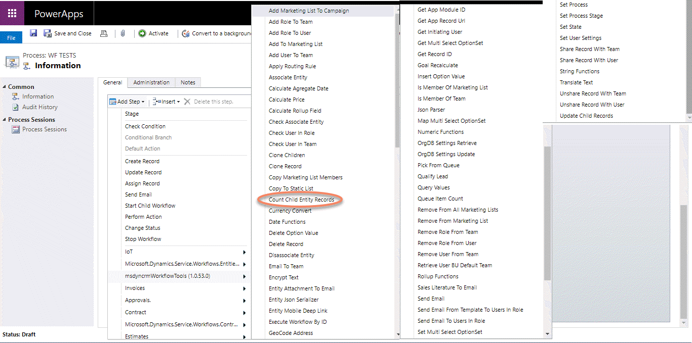
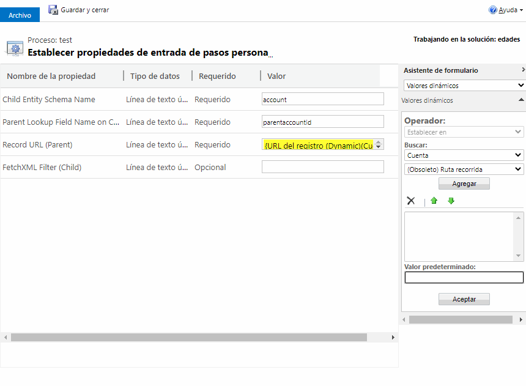
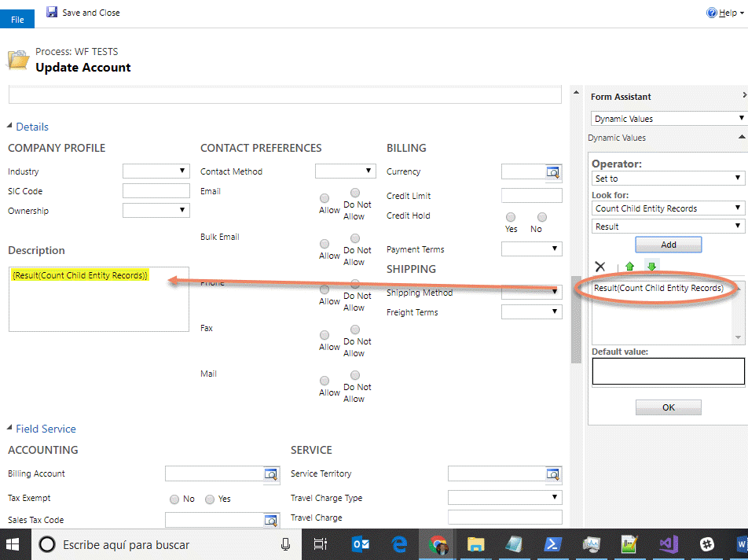

This step is for getting the total number of child records.

For using this activity you must access here and select the action:

An fill the parameters:

Finally, you can use the int Result of the app as you need:

