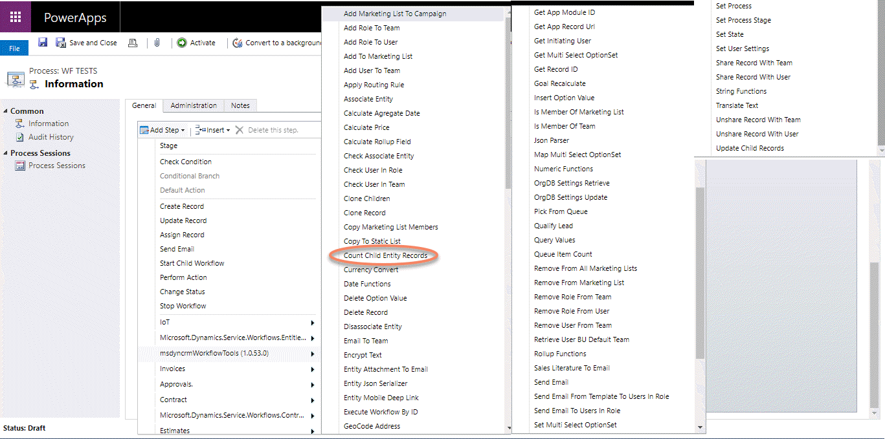
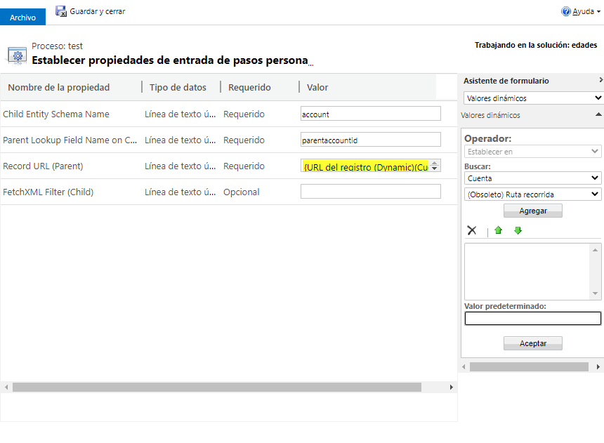
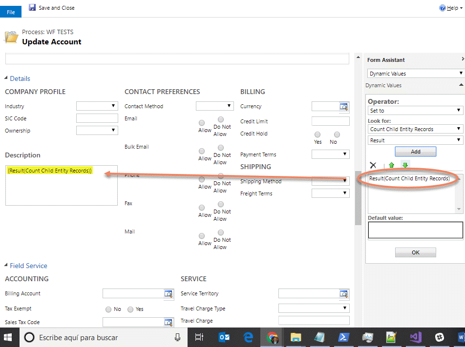

This step is for getting the total number of child records.

For using this activity you must access here and select the action:



An fill the parameters:



Finally, you can use the int Result of the app as you need:



The fourth parameter, **FetchXML Filter (Child)**, is optional. It takes only the filter and its conditions (not a whole
FetchXML query); they are combined with the parent lookup condition. For example:

```xml
<filter type="and">
  <condition attribute="new_xyzt" operator="null" />
</filter>
```

To count only active children, use:

```xml
<filter type="and">
  <condition attribute="statecode" operator="eq" value="0" />
</filter>
```

Text such as `statecode eq 0` isn't FetchXML and doesn't filter anything.

Thanks to [Augustandre23](https://github.com/Augustandre23) for this note (demianrasko/Dynamics-365-Workflow-Tools#259).
