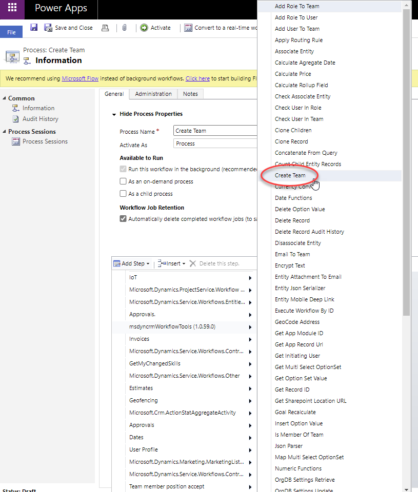

This step allows you to create a new Team on the fly.

For using this activity you must access here and select Create Team action:

Then in the activity you can fill the parameters with the URL of the record:

Parameters:
* Team Name: name os the new team
* Team Type: 0 for Owner team / 1 for access team
* Administrator: user to be administrator of the team
* Business Unit: set the business unit of the team
