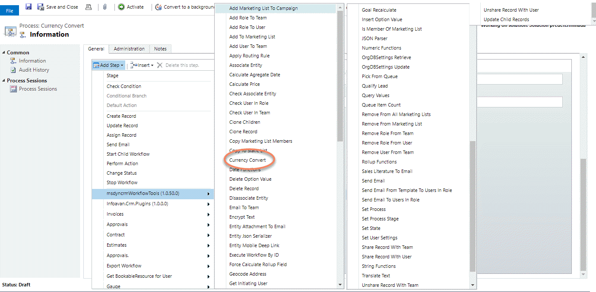
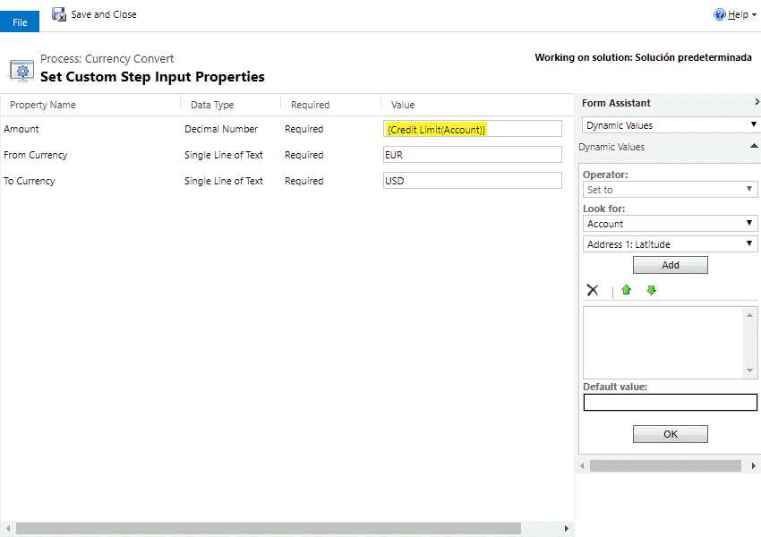
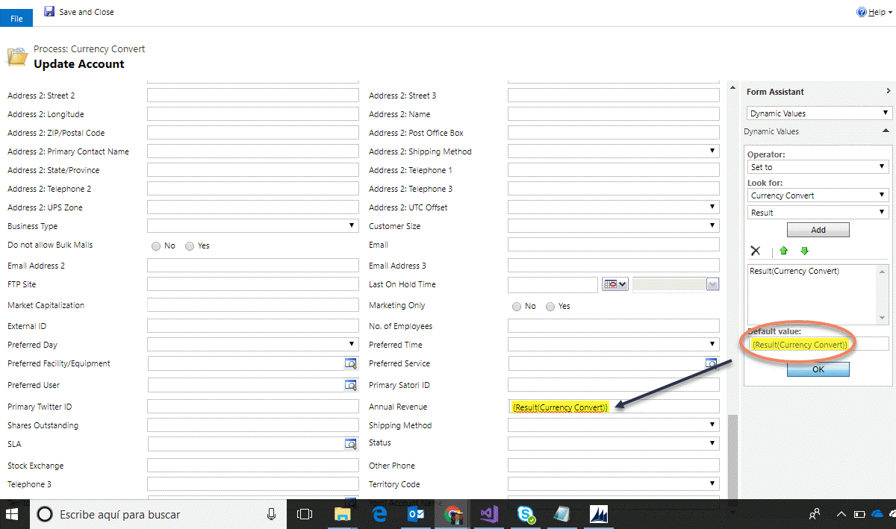

This Action allows you to convert an amount from one currency to another.
The conversion uses the European Central Bank reference rates published by Frankfurter (https://frankfurter.dev). It's free and needs no API key, and the rates are updated once per working day. Older versions used a Google converter that no longer exists.

The parameters are:
* **Amount**: the amount to convert.
* **From Currency** and **To Currency**: ISO 4217 codes, for example `USD` and `EUR`. Only the currencies the European Central Bank publishes (about 30, including USD, EUR, GBP, JPY, CAD and AUD) are supported.
* **Result** (output): the converted amount.

For using this action, just select it from the list:

And then, set the parameters:

Finnaly you can use the result:

