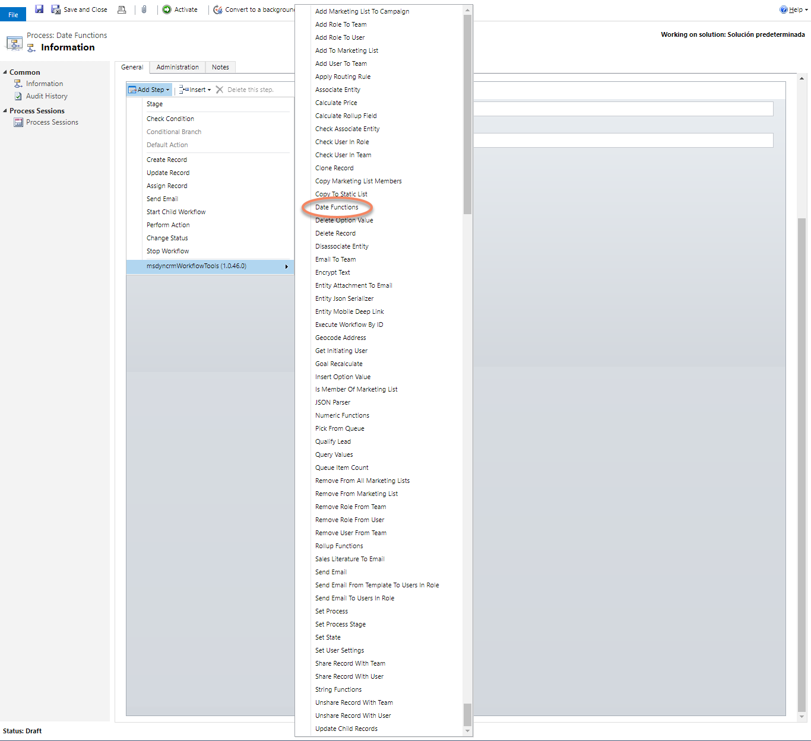
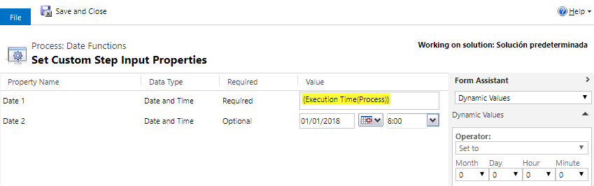
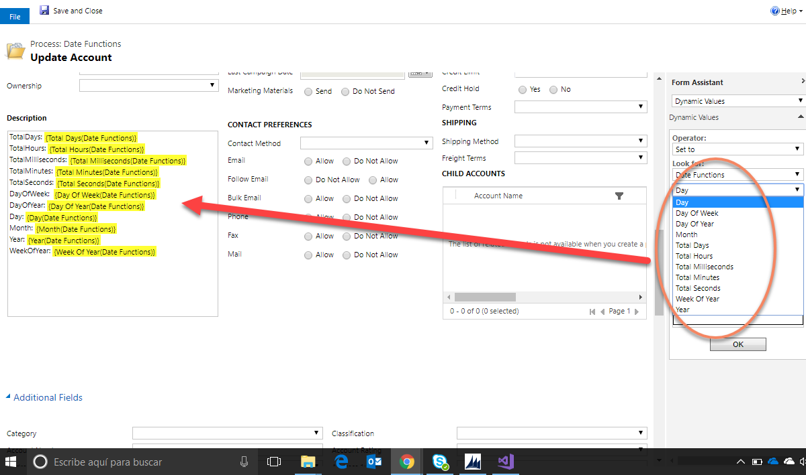

This step allows you to execute operations for DateTime valus.

For using this activity you must access here and select Date Function action:

Then in the activity you can fill the parameters for Date 1 and Date 2:

As an Output Parameters you can get all of these values:

* TotalDays: Days between the two dates
* TotalHours: Hours between the two dates
* TotalMilliseconds: Milliseconds between the two dates
* TotalMinutes: Minutes between the two dates
* TotalSeconds: Seconds between the two dates
* DayOfWeek:  Day of week (sunday:0 to saturday:6) (Of the Date 1 parameter)
* DayOfYear: Day number Of the Year (Of the Date 1 parameter)
* Day: Day of the month (Of the Date 1 parameter)
* Month: Month (Of the Date 1 parameter)
* Year: Year (Of the Date 1 parameter)
* WeekOfYear: Week Of the current Year (Of the Date 1 parameter)
 
