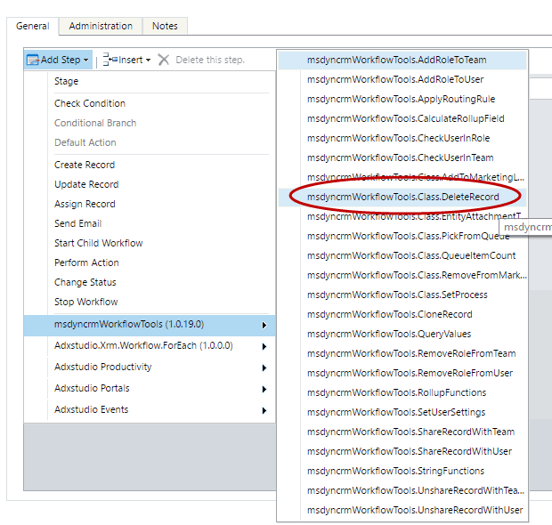
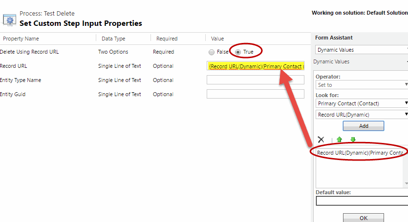
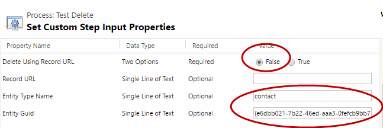

This step allows you to Delete Records.

For using this activity you must access here and select Delete Record:

Then in the activity you can fill all the parameters if you want to delete from the Record URL:

Or if you want to delete using the Entity GUID:

The Input Parameters are:
* Delete Using Record URL: to select the Deletion mode
* Record URL: Required if "Delete Using Record URL" is true
* Entity Type Name: entity schema name (in lowercase) of the entity type to be deleted. Required if "Delete Using Record URL" is false
* Entity Guid: Entity guid to be deleted. Required if "Delete Using Record URL" is false
