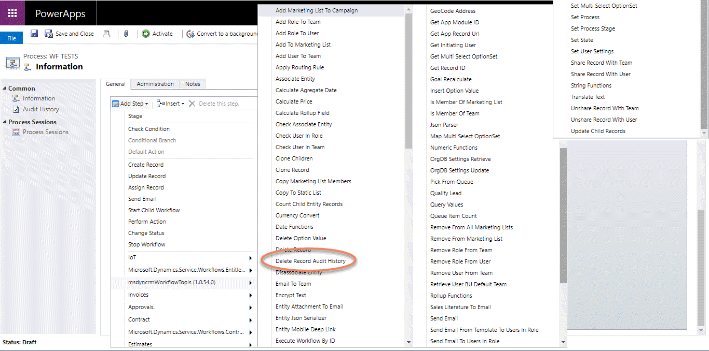
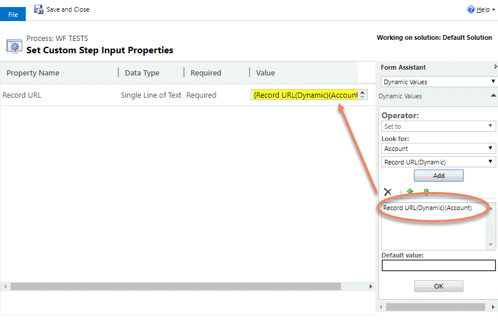
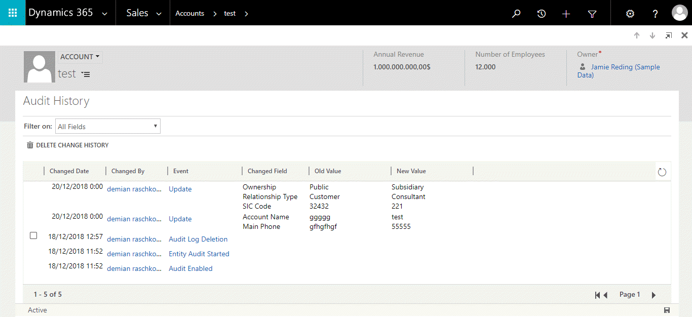
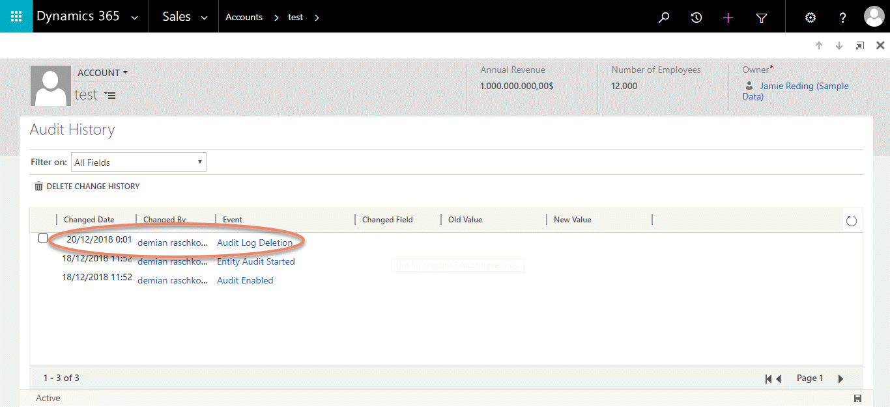

This Action deletes the Audit History of one record. 

For use this in Workflows here are the steps:

Then if you have an Audit history like this one:

After the action execution it will lilke this:

