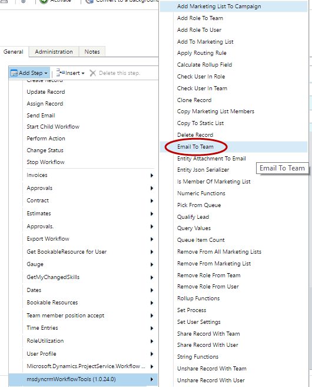
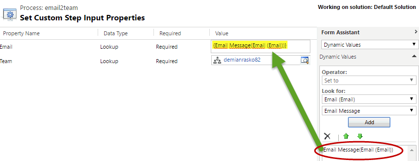
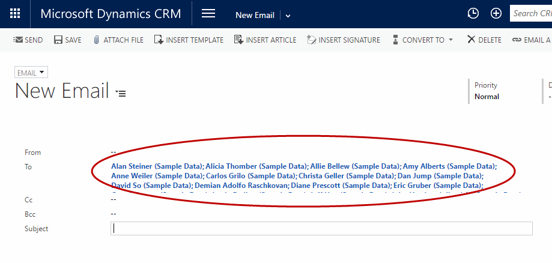

This step allows you to add all the users from a Team on the "To" field of the email record.

For using this activity you mus access here and select Email To Team:

And then you can fill the Parameters:

Then you can see all the users added on the email:

