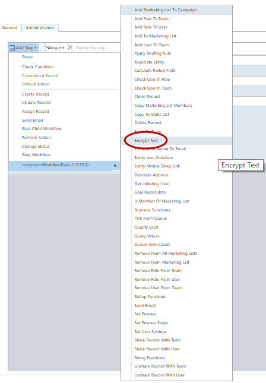
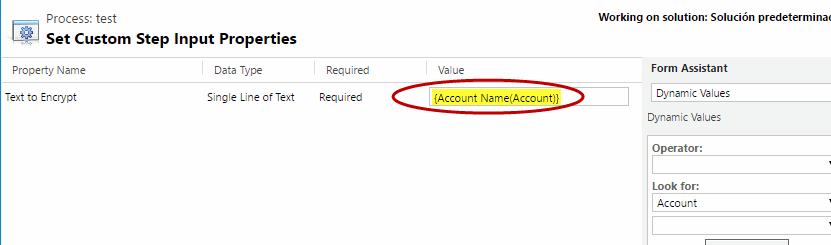
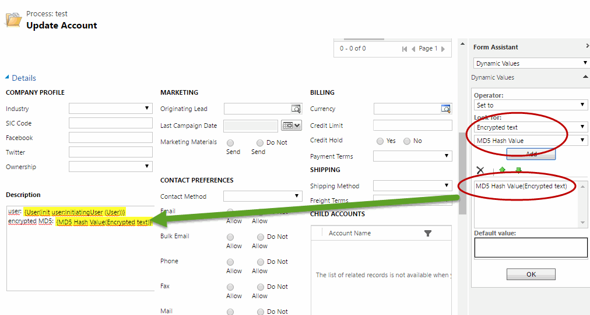
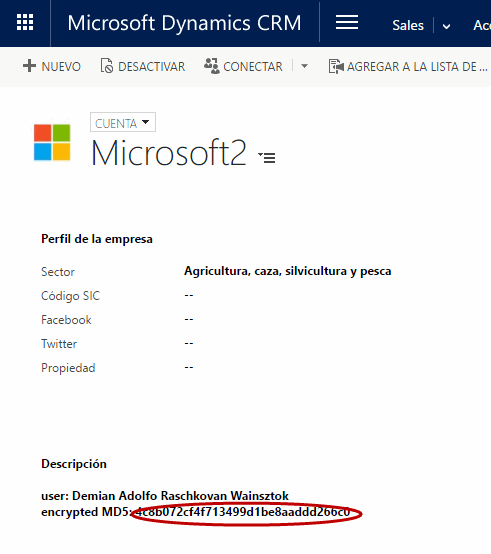

Encrypt Text action allow to retrieve the MD5 hash image of a text. Really use for Password fields.

For using this action, we can select the action:

Pass the parameter with the string to be Encrypt:

and then we can use the output parameter with the Hash:

If we use this action, the result of the MD5 is like this:

