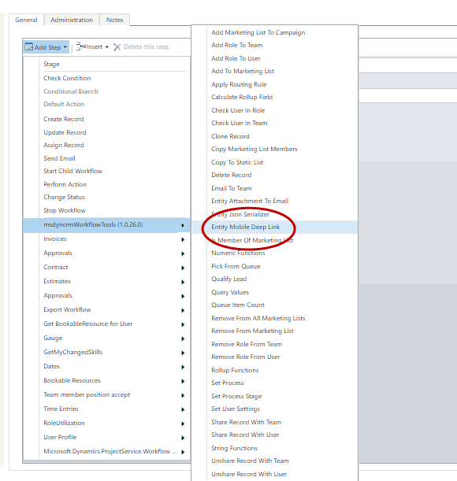
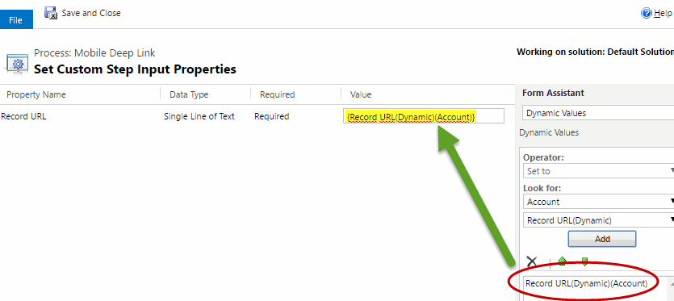
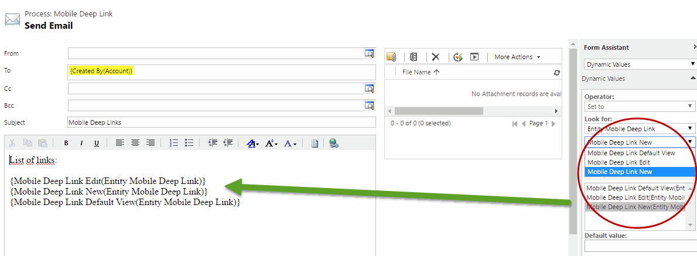
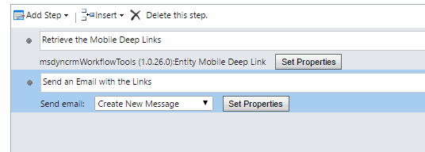
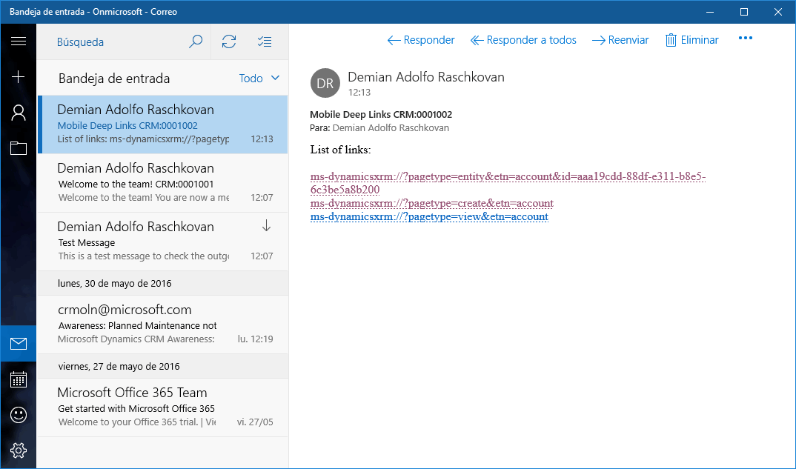
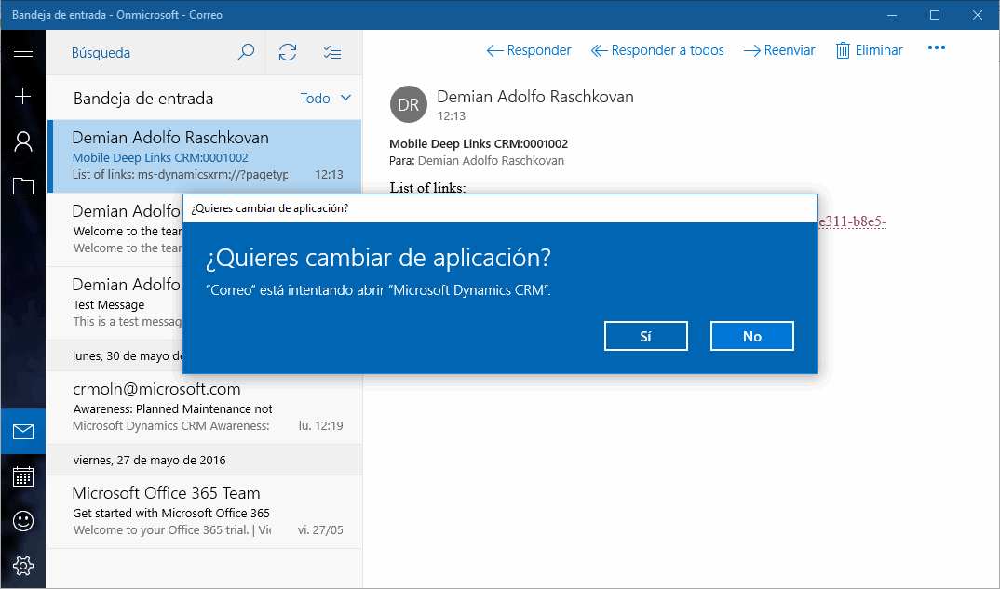
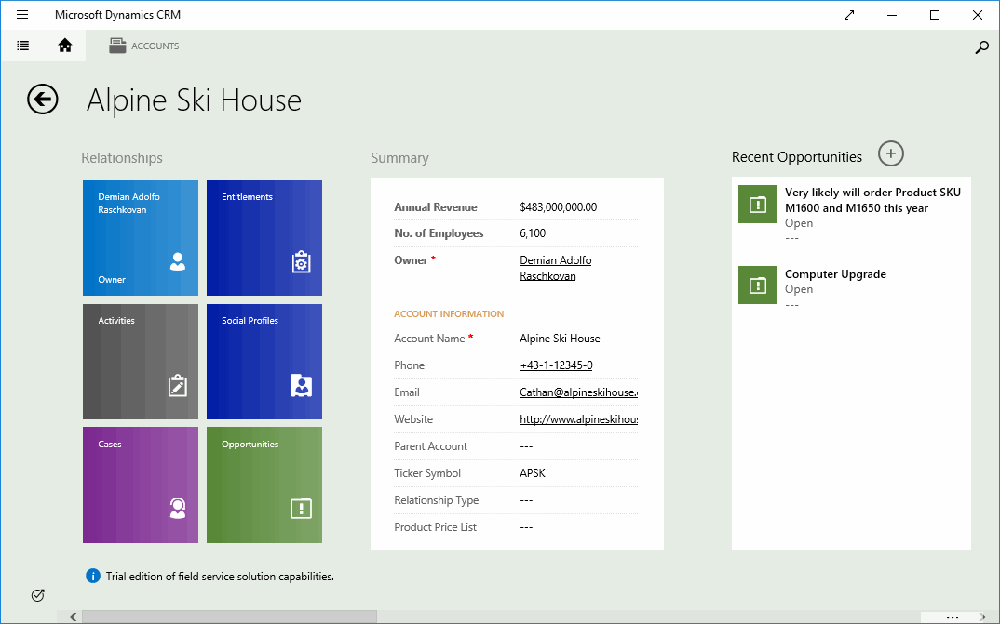
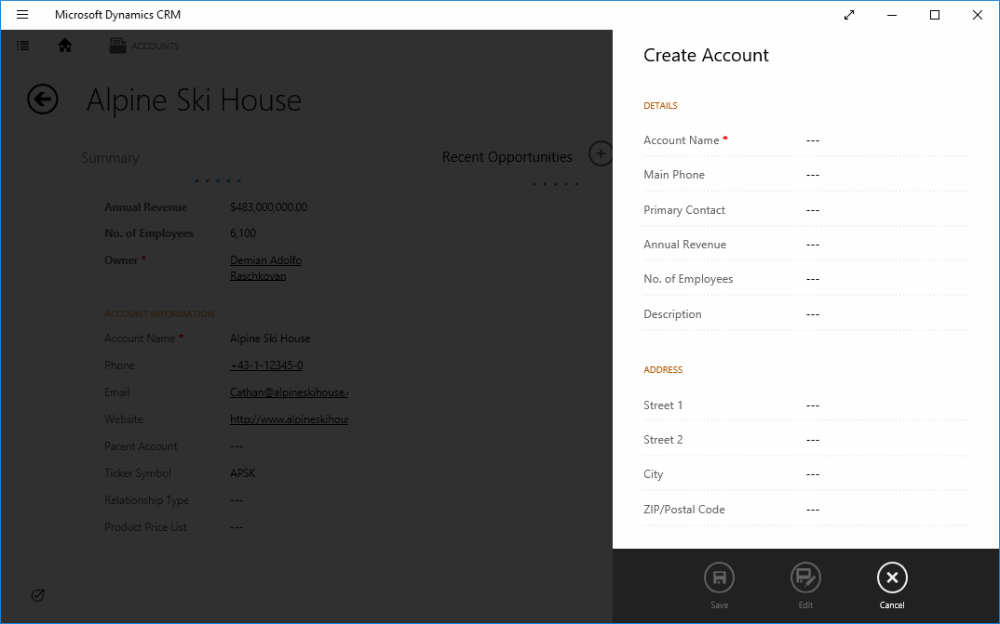
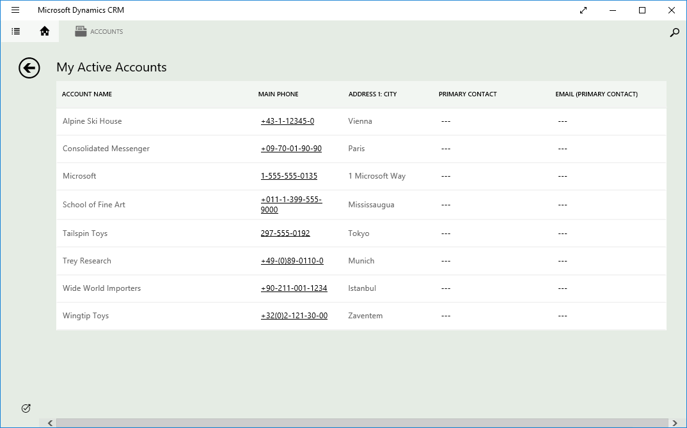

This action retrieves the Mobile Deep Links strings to be used on the workflows, for example to send them on an Email.

For using this feature, first select the Entity Mobile Deep Link action:

Then, on the input Parameters, select the record URL of the entity you want to retrieve the mobile deep link:

Then, you can use the Output parameters on the Workflow. The Output Paramaters are:

* **Mobile Deep Link Edit**: the link to go to the record form
* **Mobile Deep Link New**: the link to go to record creation form
* **Mobile Deep Link Default View**: the link to go to the default view of the entity type

This is an example of using this params in a Email:

You can retrieve and Send these Deep Links in a workflow like this:

Then, you can receive this email on a mobile app:

If you click on any link you must confirm to change the app:

The first link goes directly to the record form:

The creation form goes to here:

And the default view jumps to here:

