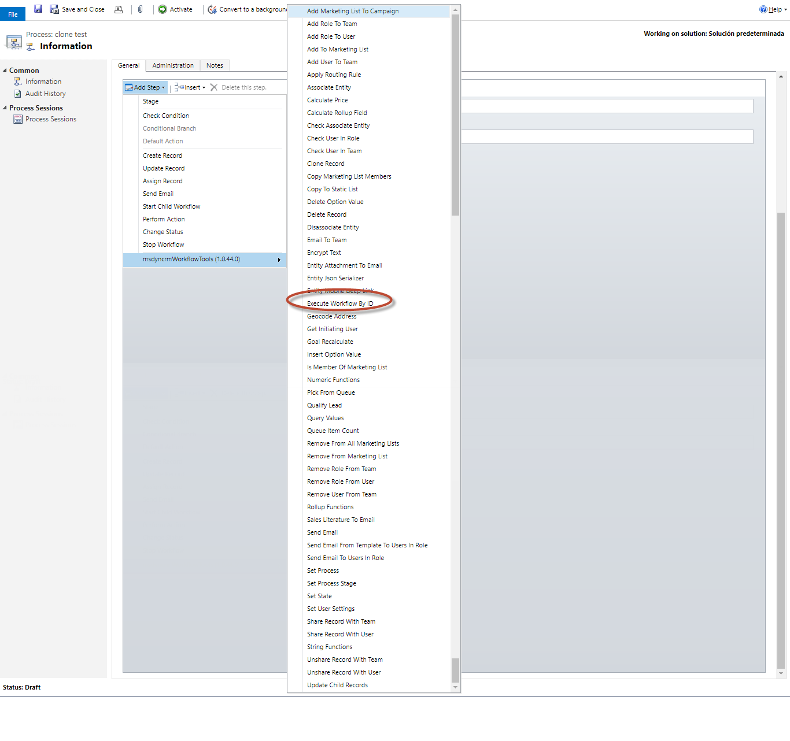
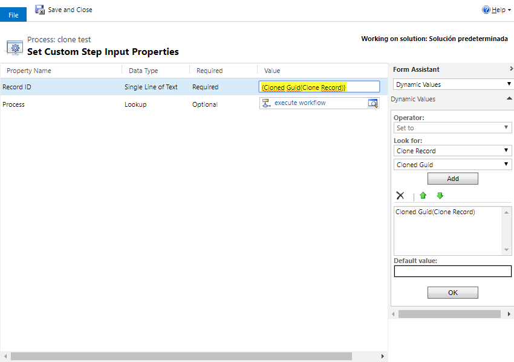

This step allows you to execute any Workflow, just passing as a parameter the GUID in string of the context record. 
It'srequired to pass a GUID of an Entity Type supported by the Workflow.

For using this activity you must access here and select Calculate Price action:

Then in the activity you can fill the parameters with the URL of the record:

NOTE: Be carefull to not create infinite Loops.
