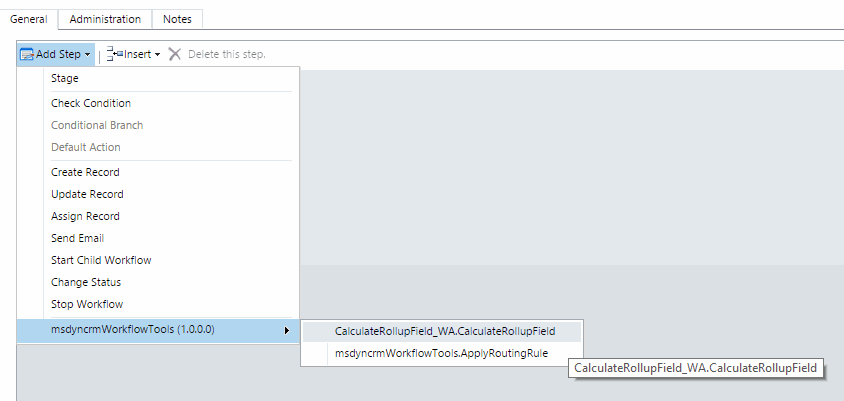

Dynamics CRM 2015 Calculate Rollup Field (Workflow Activity) will help you to force the Rollup field calculation in any time in your Workflows.

The steps to install it is really simple:

Download the full Solution
Import Solution in your Dynamics CRM 2015 environment
The to use it, you will have a new Workflow Activity Action:

Then you have to pass two parameters:

* FieldName: The Rollup field schema name of the parent entity.
* Parent RecordURL: You must to select the Parent field called Record URL

Note: The Parent Record URL, is a standard feature of Dynamics CRM, taht contains the full URL of a record. In this URL you have the entity type, and the record GUID. Right now this is the only way we have to pass a "Dynamic" EntityReference (with not hard coding an entity type) to Workflows Activities. If you pass this string URL as a parameter, in the Workflow Activity you can retrieve this entity Reference.

Done! you can execute or launch your Workflows with this new feature!