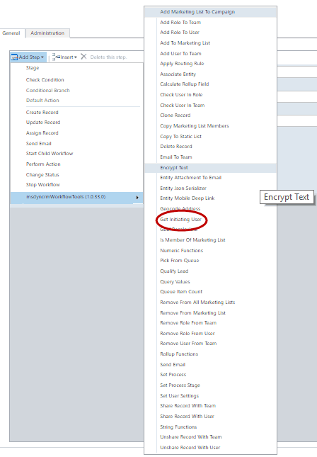
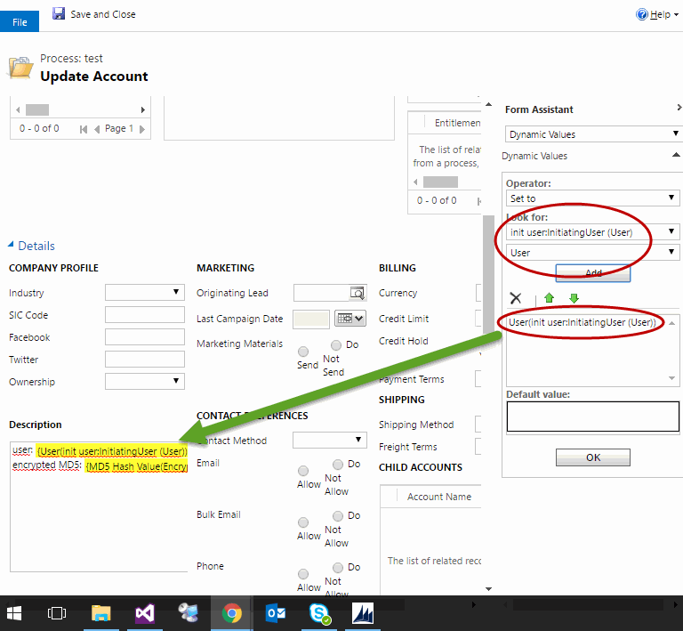

Get Initiating User Action, returns the user that originally started the Workflow execution.
For using this action, select from the list:

This action, doesn't have any input parameter, and only one output param with the User Lookup and you can use it like the following example:

