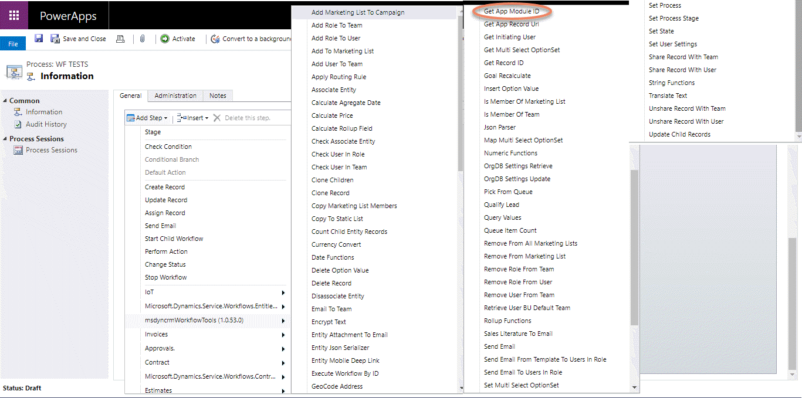
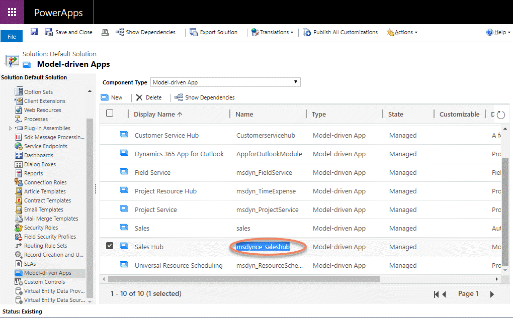
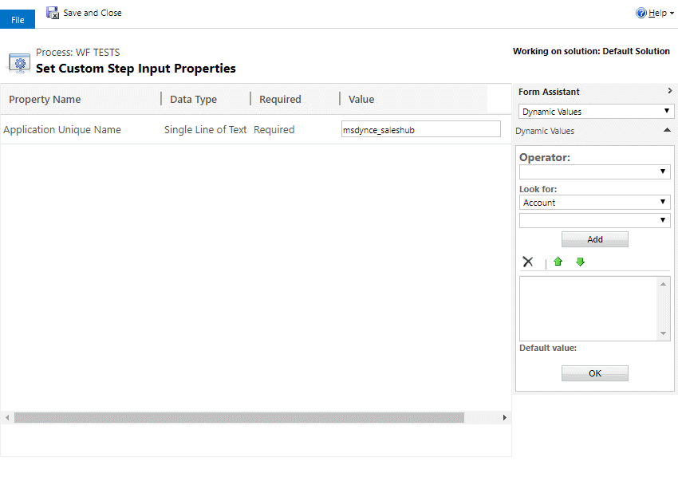
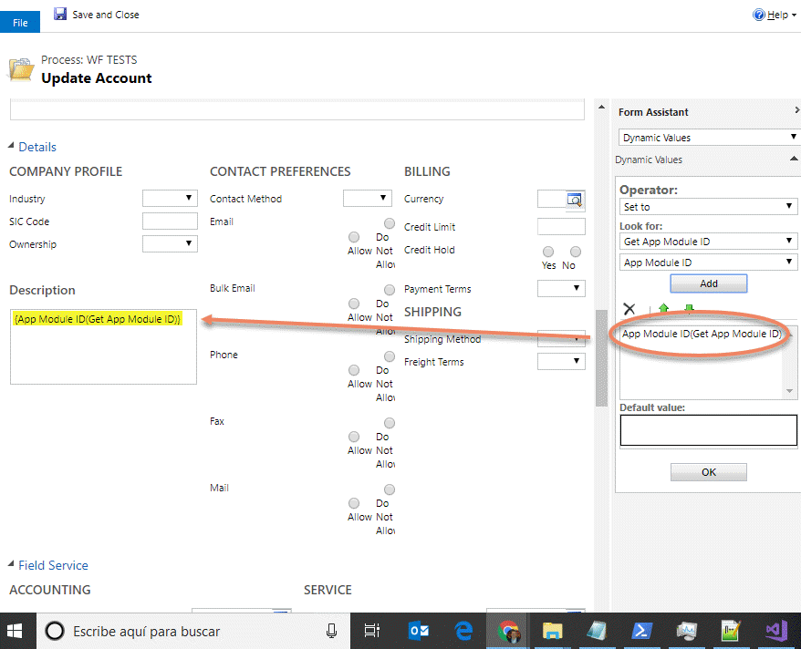

This step is for getting the App ID from the App Name (not the dysplay name).

For using this activity you must access here and select the action:

Then, the the input parameter with the App Name, you can get the name from here:

An fill the parameter:

Finally, you can use the GUID of the app as you need:

