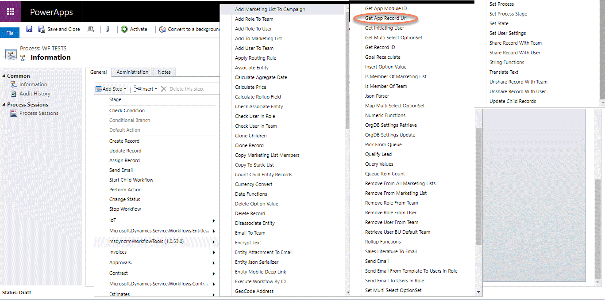
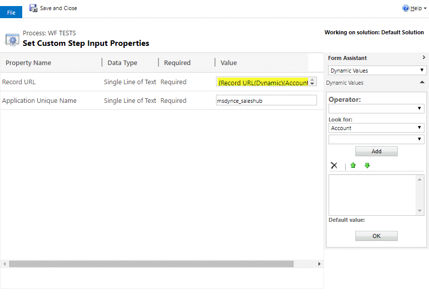
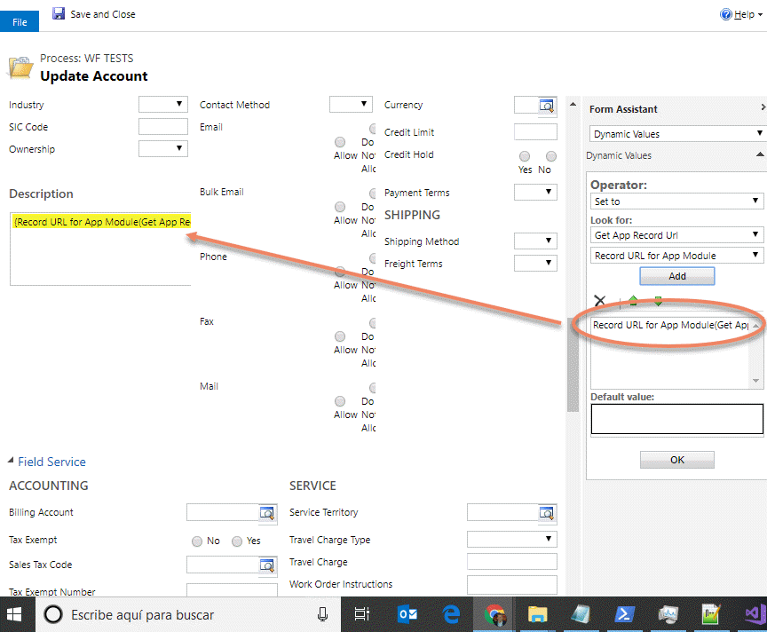

This step is for getting the Record URL for a defined App from the App Name (not the dysplay name).

For using this activity you must access here and select the action:

Then, the the input parameter with the App Name, you can get the name from here:

An fill the parameter:

Finally, you can use the GUID of the app as you need:

The result is a string like this one: https://orgname.crm4.dynamics.com:443/main.aspx?etc=1&id=aaa19cdd-88df-e311-b8e5-6c3be5a8b200&histKey=612873746&newWindow=true&pagetype=entityrecord&appid=054cec0e-8dfb-e811-a95a-000d3a45d5aa
