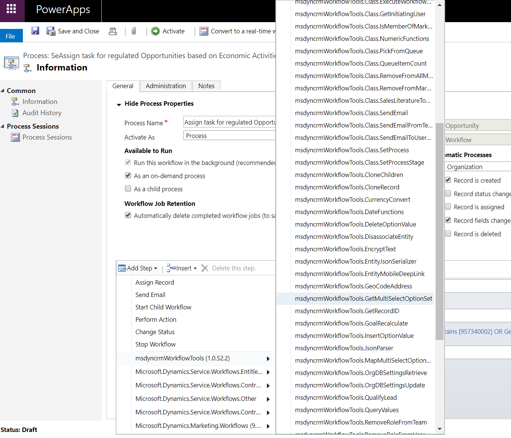
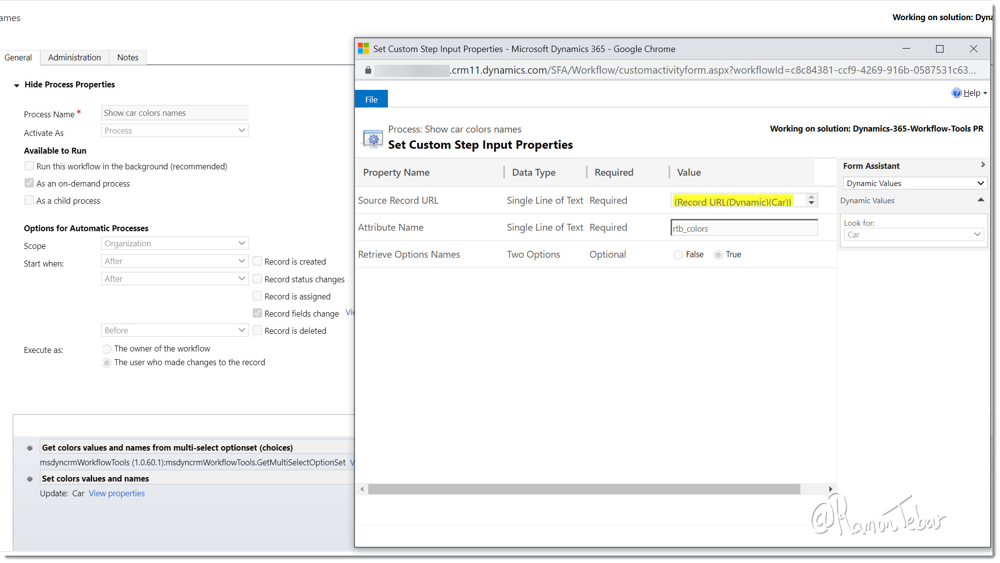

This step allows you to get the values of a  multi-select option set attribute from a particular record.

To use this activity, you just need to select the **GetMultiSelectOptionSet** option:

Then you specify the following input parameters:

* **Source Record URL (required)**: the URL of the record where the corresponding attribute is located.
* **Attribute Name (required)**: logical name of the attribute whose values are going to be retrieved.
* **Retrieve Options Names (optional)**: flag to indicate if choices (multi-select optionset) labels should be retrieved as well. This will enforce the population of the output parameter **Selected Names**.
* **Fail on Exception (optional)**: this is a secondary attribute which allows you to indicate if the activity will throw an exception if something goes wrong or it will just return the error in an output parameter.

Once they activity has been executed, there will be two output parameters:

* **Selected Values**: returns a string with the corresponding numberic option values **separated by comma**. Example: 957340000,957340001,957340002
* **Selected Names**: returns a string with the corresponding option names **separated by comma**. Example: Red,Black,White

You can also find two examples in these articles:

* [https://ramontebar.net/2018/12/12/getting-multi-select-option-set-values-in-workflows/](https://ramontebar.net/2018/12/12/getting-multi-select-option-set-values-in-workflows/)
* [https://ramontebar.net/2020/12/22/get-choices-names-in-workflows/](https://ramontebar.net/2020/12/22/get-choices-names-in-workflows/)
