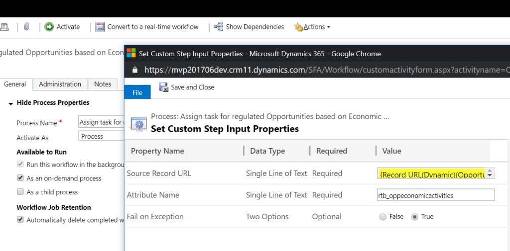

This step allows you to get the values of a  multi-select option set attribute from a particular record.

To use this activity, you just need to select the **GetMultiSelectOptionSet** option:

Then, you need to specify the following input parameters:

* **Source Record URL (required)** : the URL of the record where the corresponding attribute is located.
* **Attribute Name: (required)** : logical name of the attribute whose values are going to be retrieved.
* **Fail on Exception (optional)** : this is a secondary attribute which allows you to indicate if the activity will throw an exception if something goes wrong or it will just return the error in an output parameter.

The output parameter **Selected Values** returns a string with the corresponding results **separated by comma**. So that you can check them using the contains operator for example.

You can also find an example in this article:

[https://ramontebar.net/2018/12/12/getting-multi-select-option-set-values-in-workflows/](https://ramontebar.net/2018/12/12/getting-multi-select-option-set-values-in-workflows/)
