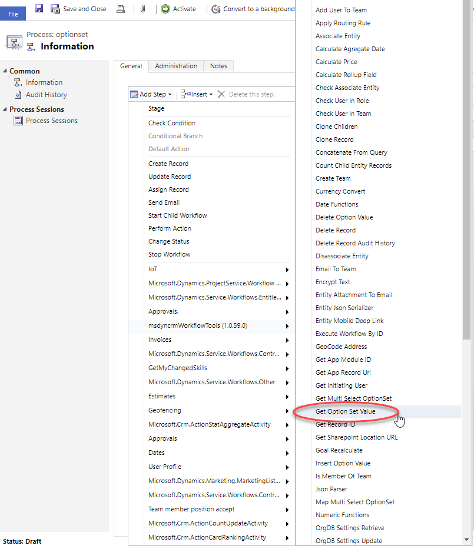
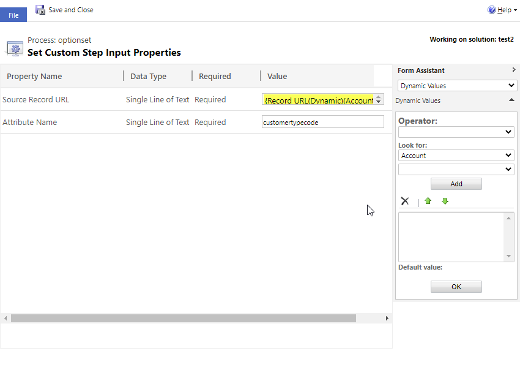

This step allows you to retrieve the int value of the selected value of the optionset in the record.

For using this activity you must access here and select Get Option Set Value action:

Then in the activity you can fill the parameters with the URL of the record:

The parameters are:
* Source Record URL: complete URL to the record
* Attribute Name: schema name of the field to be retrieved the value
