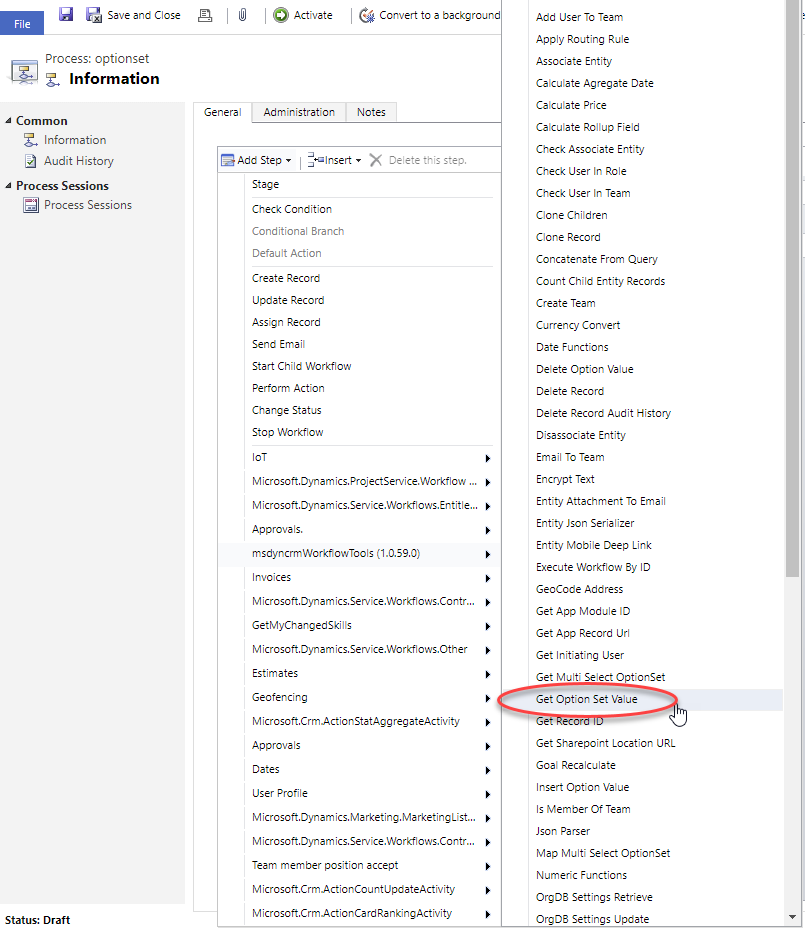
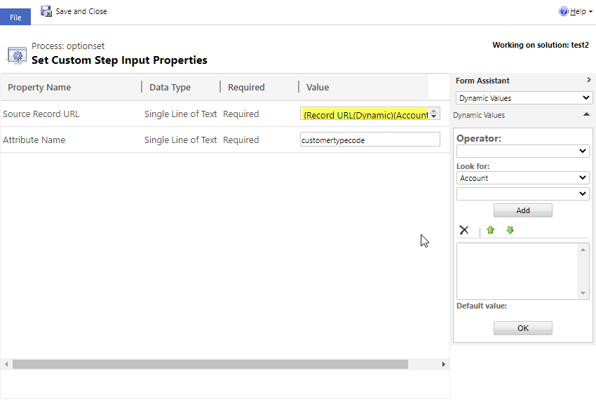

This step allows you to retrieve the int value of the selected value of the optionset in the record.

For using this activity you must access here and select Get Option Set Value action:

Then in the activity you can fill the parameters with the URL of the record:

The parameters are:
* Source Record URL: complete URL to the record
* Attribute Name: schema name of the field to be retrieved the value

The outputs are:
* Value: the selected value as a whole number, or 0 when no value is selected.
* Value (Text): the same value as plain digits, for example `100000001`. Use it when the value goes into text, such as a FetchXML condition in Rollup Functions or Count Child Entity Records. When the whole number Value is put into text, it's formatted with the user's digit grouping (`100,000,001`), and FetchXML rejects that.
