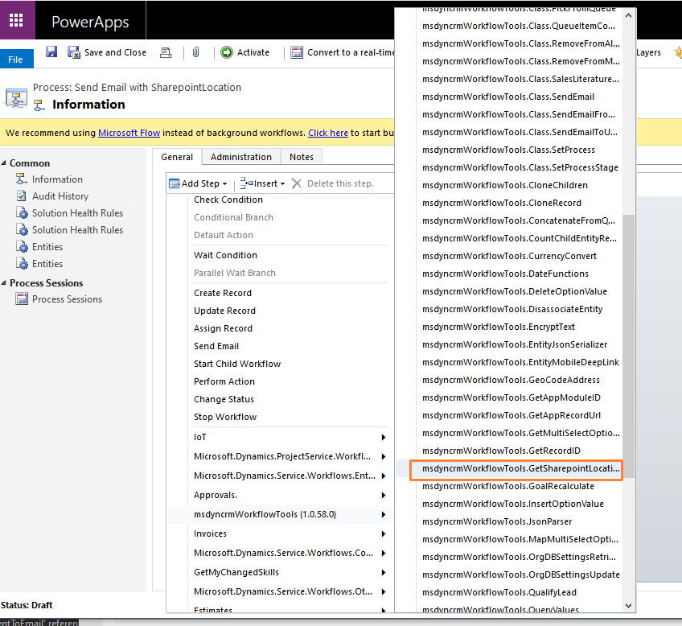
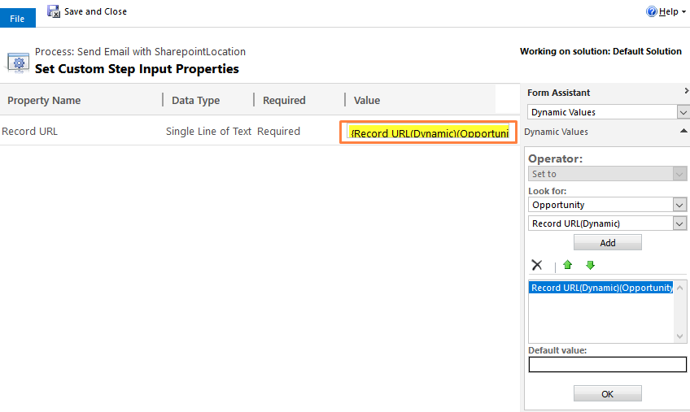
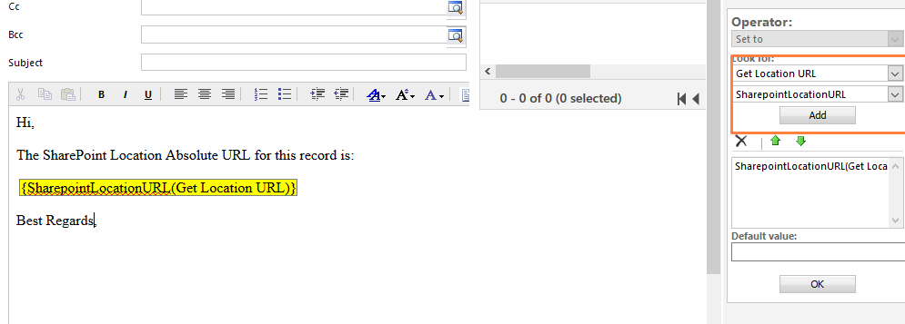

This step will receive the record url from dynamics and return the Absolute URL of the sharepoint location.

For using this activity you select the GetSharepointLocationURL step:

Then pass the record URL as the input parameter:  

And to use you look for the Get Location URL and use the SharepointLocationURL property: 

