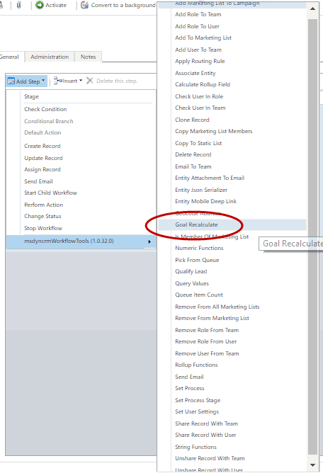
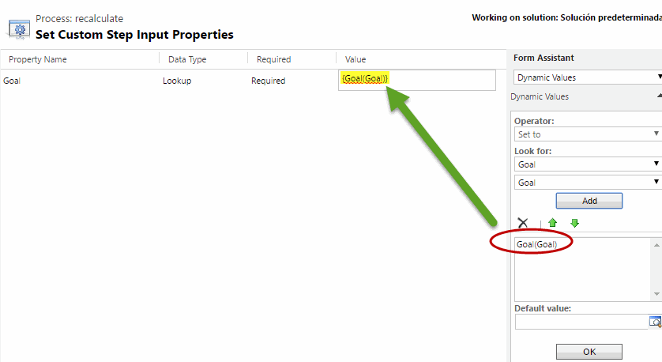

The Goal Recalculate function, forces the sync recalculation of the Goal that occours async in the server.
For using this step, first select the action:

and then, fill the parameter with the Goal you want to recalculate:

