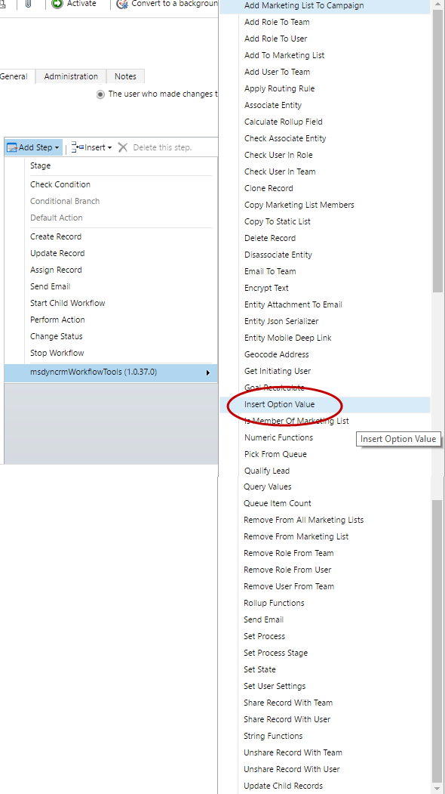
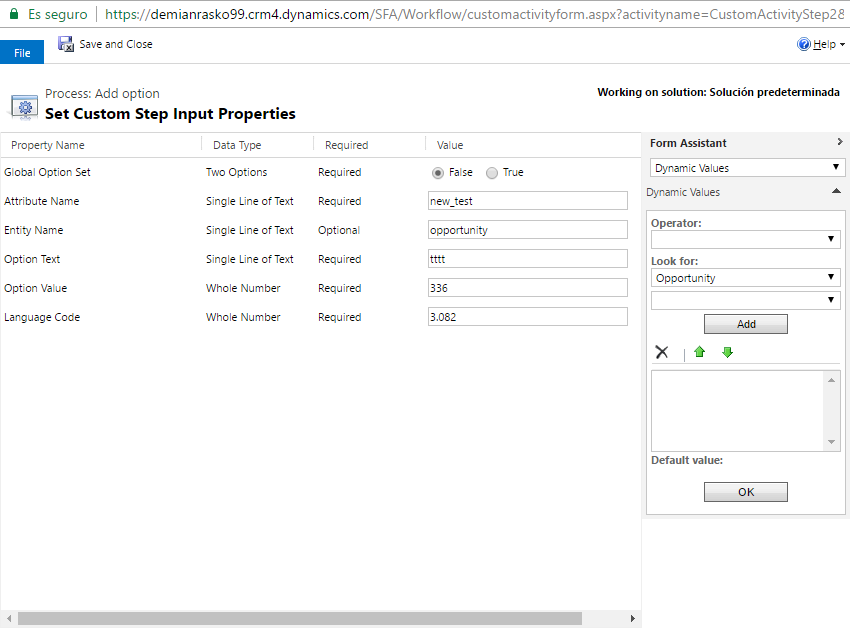

Insert Option Value is an action to Add new values to global and local OptionSets.
For using this action, first select the action:

Then fill all the paramaters:

The parameters are:
* **Global Option Set**: set if the OptionSet is Global or not
* **Attribute Name**: name of the local or global OptionSet
* **Entity Name**: (optional) with the name of the entity. Only required for local optionsets
* **Option Text**: Text of the new option to be added (label)
* **Option Value**: Value of the new option to be added
* **Language Code**: Language Code of the label
