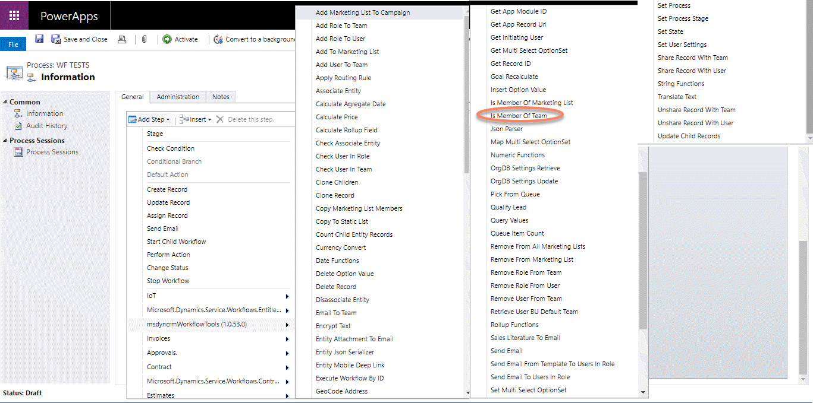
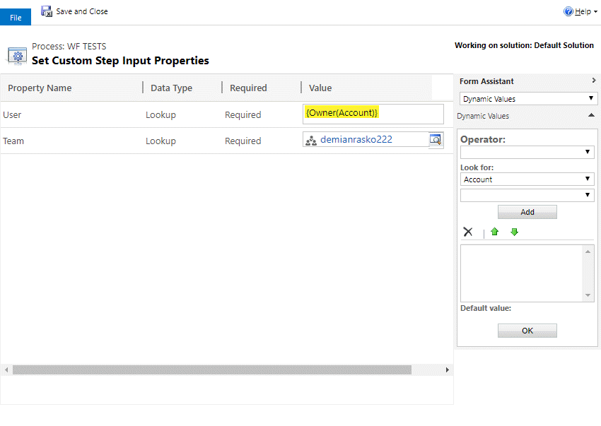
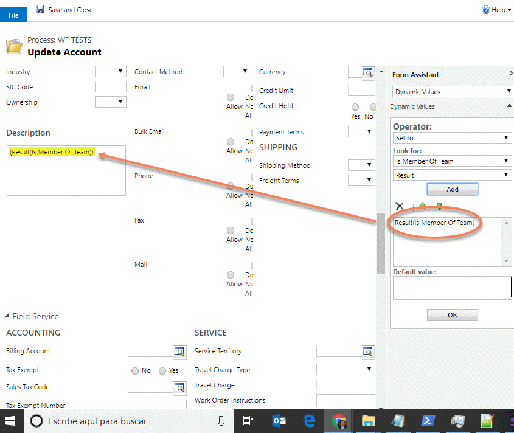

This step is for asking if a defined user is member of a team or not.

For using this activity you must access here and select the action:

An fill the parameters (User and Team):

Finally, you can use the result as you need (boolean):

