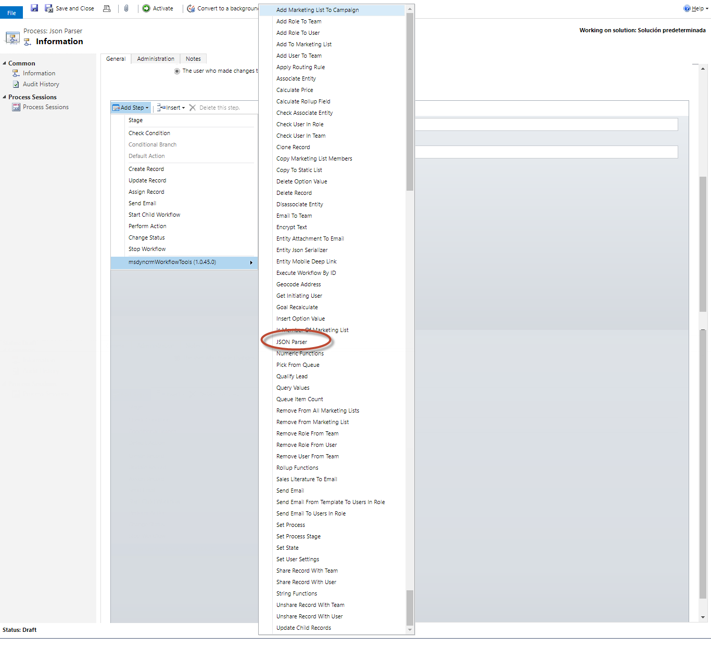
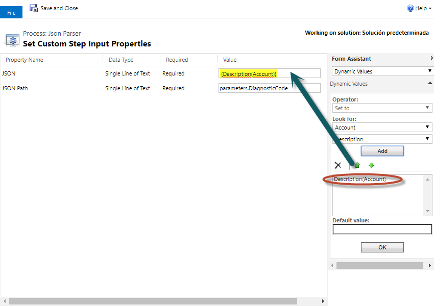
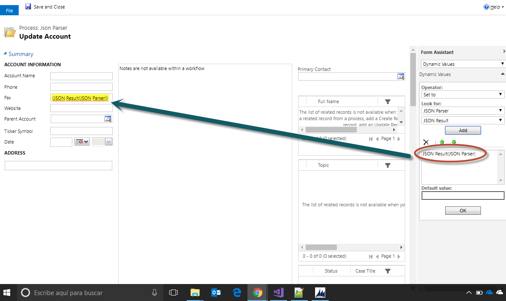
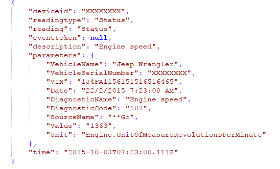

This step allows you to get any string value from a JSON. this method uses JSON.NET library (https://www.newtonsoft.com) and this method:
https://www.newtonsoft.com/json/help/html/SelectToken.htm

For using this activity you must access here and select JSON Parser action:

Then in the activity you can fill the parameters with the full JSON text and then the Path to get the value:

Finnaly you can retrieve the value from the result, and use it in any method:

An example on this if a JSON returned by Azure IoT:

using this path "parameters.DiagnosticCode" returns a velue of "107".

Thanks!
