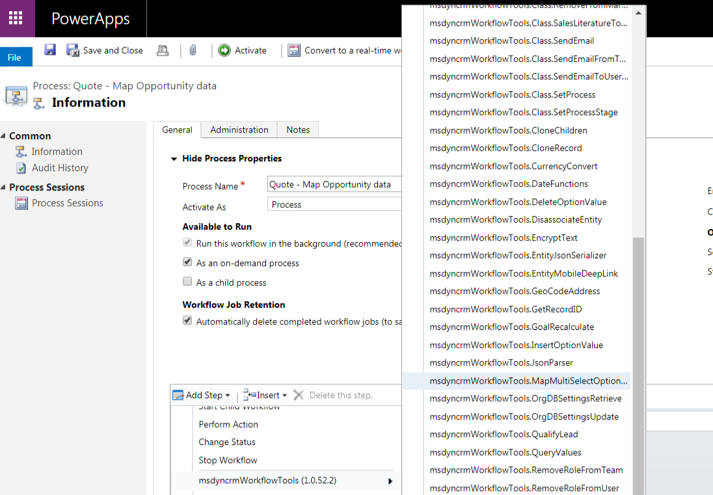
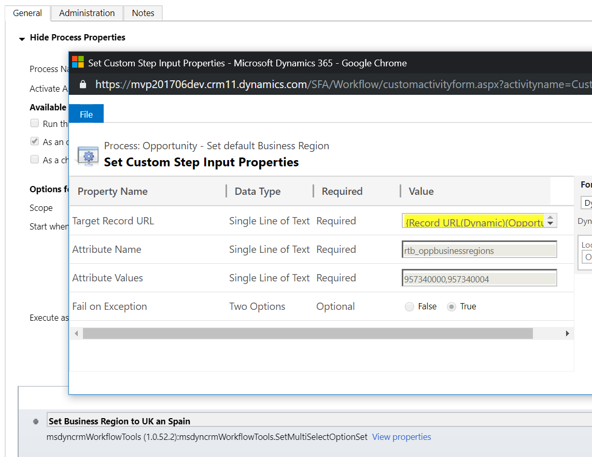

This step allows you to copy multi-select option set attributes between two records.

To use this activity, you just need to select the **MapMultiSelectOptionSet** option:

Then, you need to specify the following parameters:

* **Source Record URL (required)** : Dynamics URL of the record whose multi-select option set attributes will be copied from. Notice the Dynamics workflow designer allows you to create this URL easily for the accessible entities in the workflow context.
* **Source Attributes: (required)** : list of attributes separated by comma to be copied.
* **Target Record URL (required)** : Dynamics URL of the record where the attributes will be copied to.
* **Target Attributes: (required)** : list of attributes separated by comma where the original values are copied to. For the mapping to be correct, **the order needs to be the same as the Source Attributes**.
* **Keep Existing Values (optional)**: indicate if the existing selected values in the target multi-select optionset attribute will be maintained. By default, it will remove the existing values and assign the new ones given by the argument "Attributes Values".
* **Fail on Exception (optional)** : this is a secondary attribute which allows you to indicate if the activity will throw an exception if something goes wrong or it will just return the error in an output parameter.

You can also find an example in this article:

[https://ramontebar.net/2018/12/08/copying-multi-select-option-sets-in-workflows/](https://ramontebar.net/2018/12/08/copying-multi-select-option-sets-in-workflows/)
