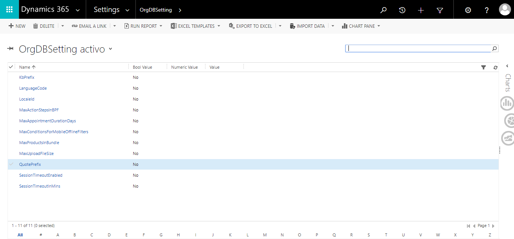
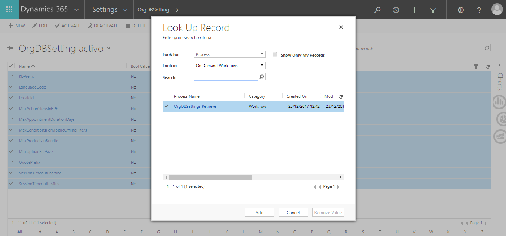
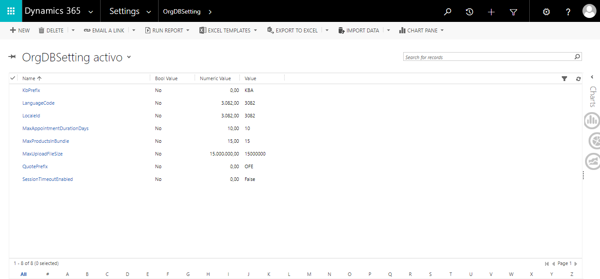

For using the OrgDbSettings Update&Retrieve actions, you can create a customized entity linke this one:

Customize a retrieve and Update workflows to fill and update the values so you can run the workflow to retrieve the values, and then, on update, change the values:

