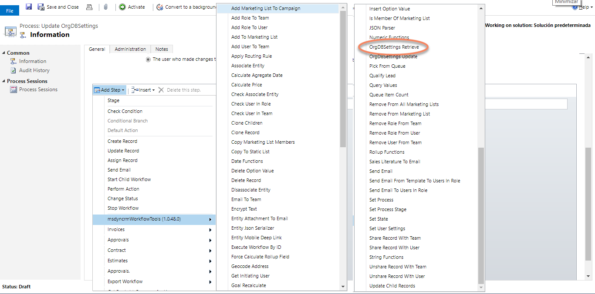
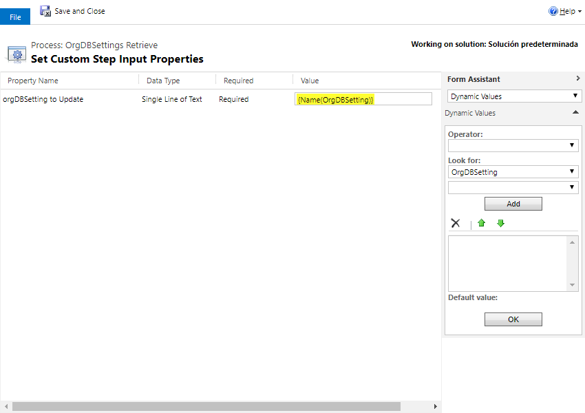
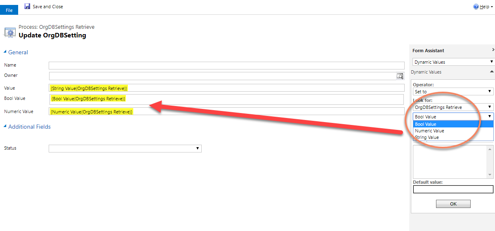

This Action allows you to retrieve the Organization settings. 
All the organization settings available to be updated are here: https://docs.microsoft.com/en-us/dynamics365/customer-engagement/developer/entities/organization under "Writable attributes".
Example settings are: 
- KbPrefix
- LanguageCode
- LocaleId
- MaxAppointmentDurationDays
- MaxProductsInBundle
- MaxUploadFileSize
- QuotePrefix
- SessionTimeoutEnabled
- and many more...

For using this action, just select it from the list:

And then, select the values:

Finally you have three output parameters, depending on the value type (String, Number or Bool) and you can use them:

A really good example for using OrgDBSettings Update&Retrieve is here: [OrgDBSettings Example](OrgDBSettingsExample.md) 

Regards!
