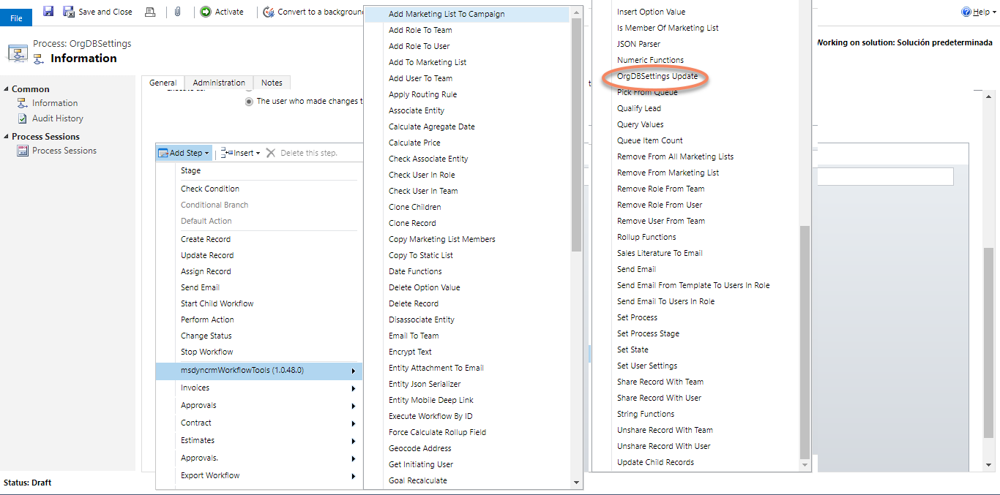
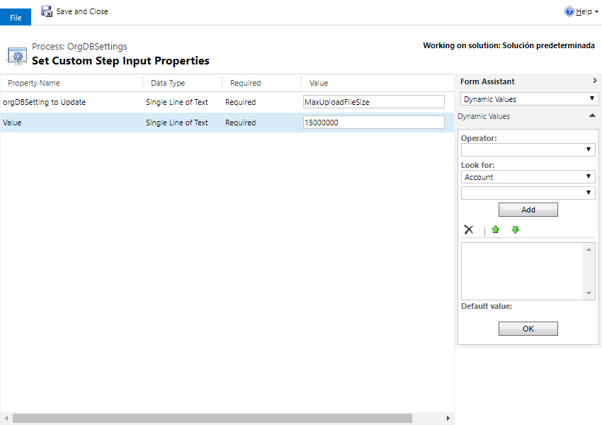

This Action allows you to modify the Organization settings. 
All the organization settings available to be updated are here: https://docs.microsoft.com/en-us/dynamics365/customer-engagement/developer/entities/organization under "Writable attributes".
Example settings are: 
- KbPrefix
- LanguageCode
- LocaleId
- MaxAppointmentDurationDays
- MaxProductsInBundle
- MaxUploadFileSize
- QuotePrefix
- SessionTimeoutEnabled
- and many more...

For using this action, just select it from the list:

And then, select the values:

This is a great tool to be used in a Dialog (deprecated), or maybe to create a new entity with all the OrgDBSettings, and fire a workflow to upload them in background.

A really good example for using OrgDBSettings Update&Retrieve is here: [OrgDBSettings Example](OrgDBSettingsExample.md) 

Regards!
