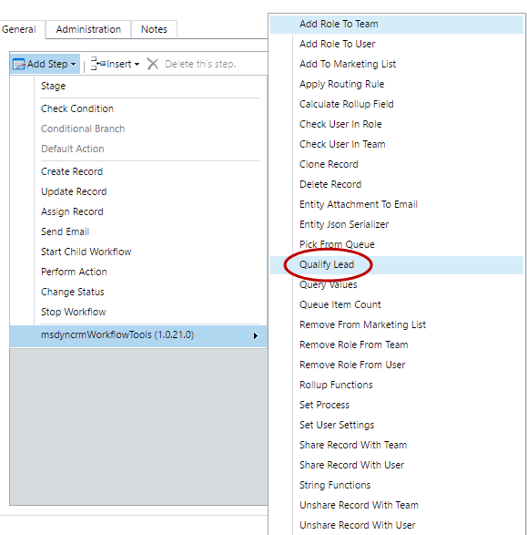
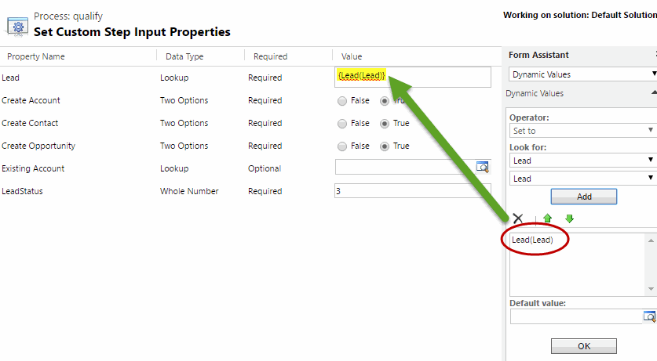

This step allows you to Qualify a Lead.

For using this activity you must access here and select Qualify Lead:

Then in the activity you can fill the following parameters: 

The Parameters are:
* Lead: Lead to be Qualified
* Create Account: true/false to set if we want to create a new account
* Create Contact: true/false to set if we want to create a new contact
* Create Opportunity: true/false to set if we want to create a new Opportunity
* Existing Account: to set an existing account to be set on new created Opportunity
* LeadStatus: "3" for example for Qualify Status
