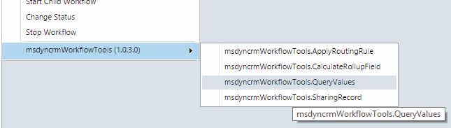
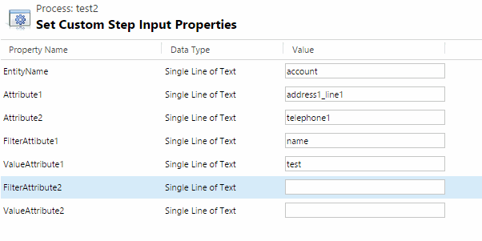
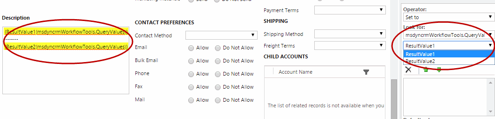

This step is very usefull to query an entity, filtering with one or two field conditions, and get one or two fields.
Could be very usefull to retrieve some parameters located in another entities such as parameters entities.

For use this in Workflows here are the steps:

First select the step:

Then, fill all the required fields:

The full fields description are:
* **EntityName (required)** : the schema name of the entity to be searched
* **Attribute1 (required)** :  first attribute to be retrieved
* **Attribute2** :  second attribute to be retrieved
* **FilterAttibute1 (required)** :  first filter attribute name 
* **ValueAttribute1 (required)** :  first filter attribute value 
* **FilterAttibute2** :  second filter attribute name 
* **ValueAttribute2** :  second filter attribute value 
* **ResultValue1** :  retrieved value for the first attibute
* **ResultValue2** :  retrieved value for the second attibute 

IMPORTANT NOTE: since version 1.0.36.0 the Attribute2 Parameter is required. for previous versions, please remember to fill something on it.

Then you can use the retrieved values in following steps of the Workflow:

