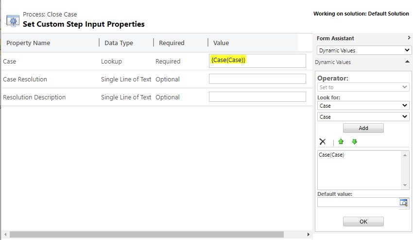

**Resolve Case**

This step allows you to specify the Resolution (subject) and Remarks (description) fields on the Case Resolution entity, when resolving an Case via workflow.

Normally, when resolving an Case with a workflow, you are unable to specify these fields and they will created with blank values.

This is especially useful when importing Case records and wanting to resolve them immediately.

**Parameters** 

**Case:** The Case to resolve

**Case Resolution (optional):** This populates the resolution (subject) field on the Case Resolution activity 

**Resolution Description (optional):** This populates the remarks (description) field on the Case Resolution activity 

