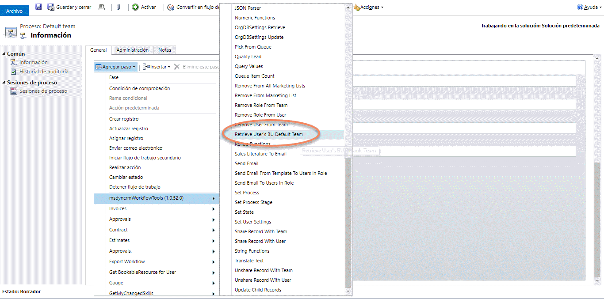
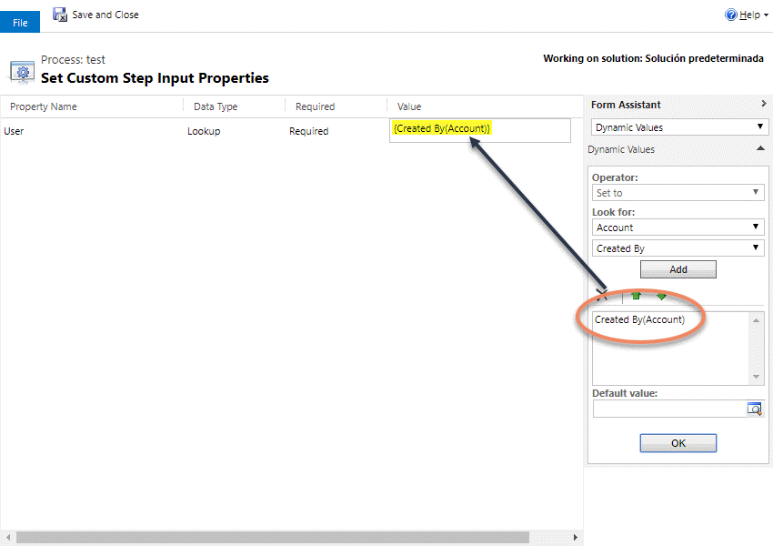
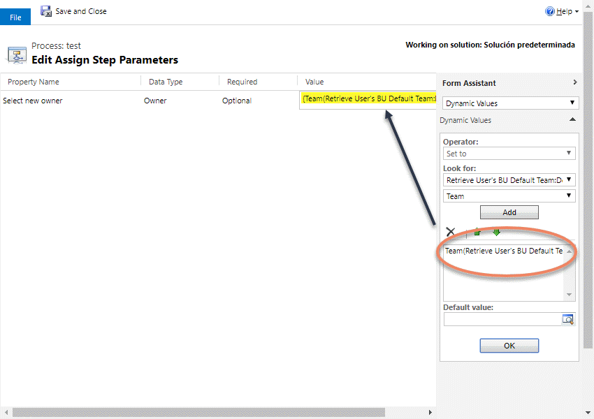

This Action allows you to get the Default Team of the User's Business Unit.

For using this action, just select it from the list:

Then, fill the parameter:

And you can use the Team in other actions:

