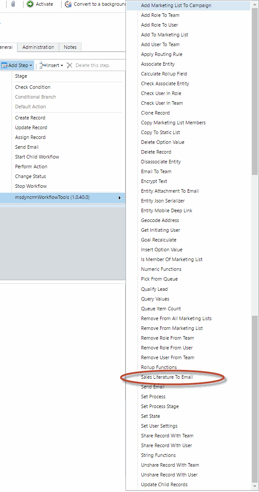
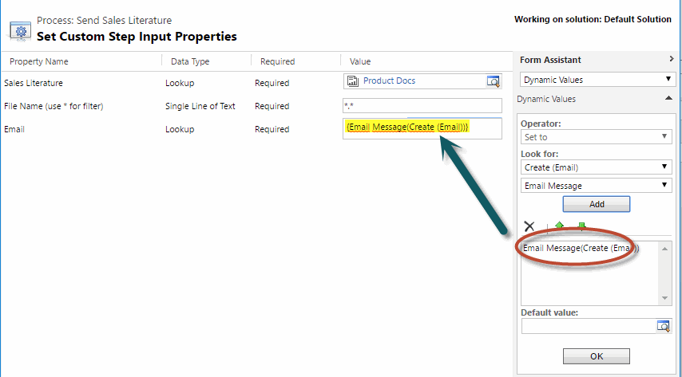

This step allows you to retrieve Documents from Sales Literature, and attach them to a created Email record. 
You can also filter the attached Files by FileName.

For using this activity you must access here and select Sales Literature To Email:

Then in the activity you can fill all the parameters:

