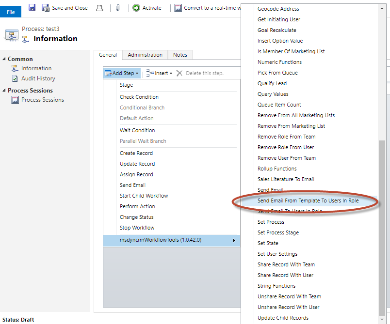
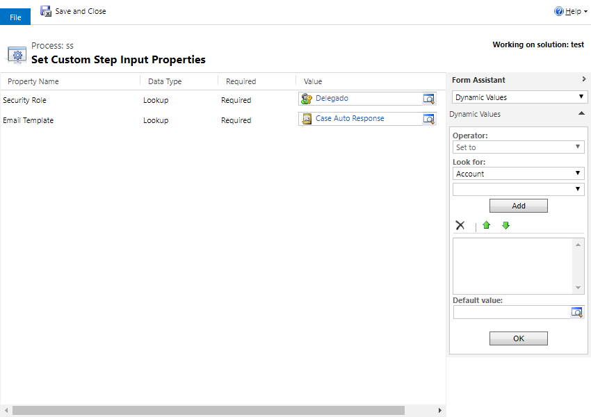

This step allows you to create and send an email based on template to all users that have assigned a defined security role.
In this case, it will create one individual email for each users identified.

For using this activity you must access here and select Send Email From Template To Users In Role:

Then in the activity you can fill all the parameters:

