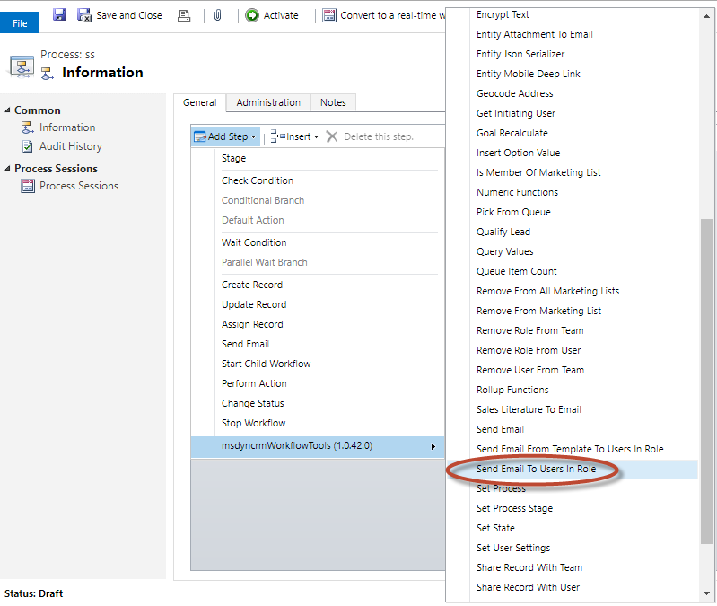
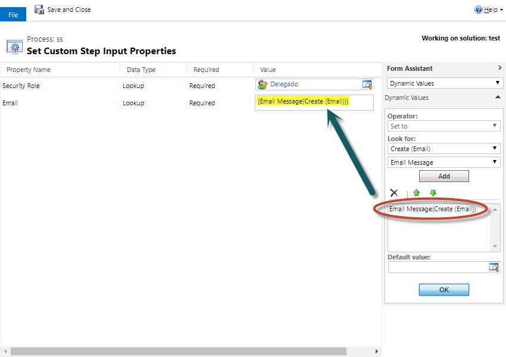

This step allows you to add users that have assigned specied security role as recipients to a previous created email. 

For using this activity you must access here and select Send Email To Users In Role:

Then in the activity you can fill all the parameters:

