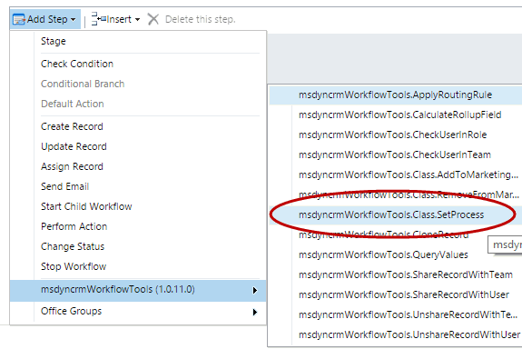
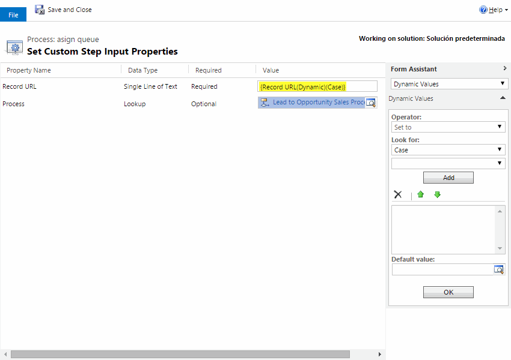

This step is very usefull to set the active Business Process Flow on a specified record.
You can also restart the process (setting the same process), or remove the process execution (blank value).
For using this activity you mus access here and select Set Process:

Then, you must select the record URL(dynamic) field from the entity you want to set the process, and select the Process:

The full params description is:
* **Record URL (required)** : the URL of the record you want to change the process
* **Process**: you must select a business process flow. Note that you must change the filter on the view, to select the business process flow. 

Note: The Parent Record URL, is a standard feature of Dynamics CRM, taht contains the full URL of a record. In this URL you have the entity type, and the record GUID. Right now this is the only way we have to pass a "Dynamic" EntityReference (with not hard coding an entity type) to Workflows Activities. If you pass this string URL as a parameter, in the Workflow Activity you can retrieve this entity Reference.
