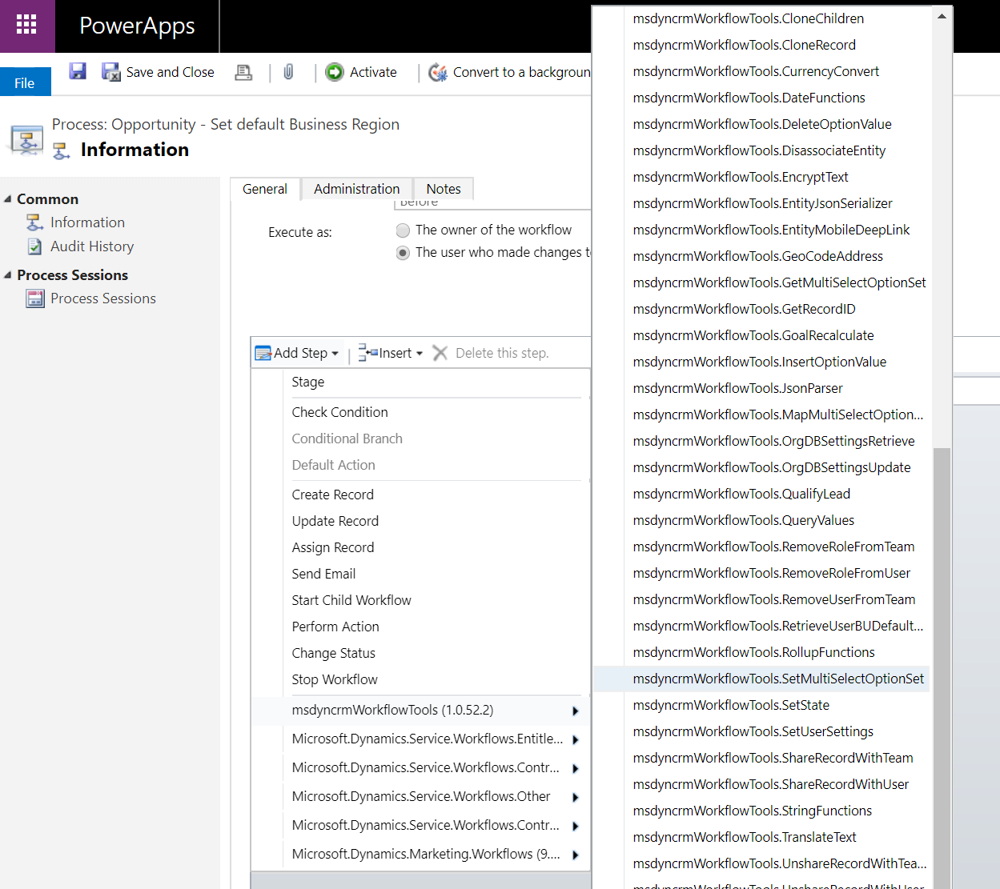

This step allows you to update the value of a multi-select option set attribute for a particular record.

To use this activity, you just need to select the **SetMultiSelectOptionSet** option:

Then, you need to specify the following input parameters:

* **Target Record URL (required)** : URL of the record to be updated.
* **Attribute Name: (required)** : logical name of the attribute to be updated.
* **Attribute Values: (required)** : option set values to be set. They should be **separated by comma**. In case you want to **clear the values**, just use an **empty string like “”**. See an example below.
* **Keep Existing Values (optional)**: indicate if the existing selected values in the target multi-select optionset attribute will be maintained. By default, it will remove the existing values and assign the new ones given by the argument "Attributes Values".
* **Fail on Exception (optional)** : this is a secondary attribute which allows you to indicate if the activity will throw an exception if something goes wrong or it will just return the error in an output parameter.

You can also find an example in this article:

[https://ramontebar.net/2018/12/12/updating-multi-select-option-set-attributes-in-workflows/](https://ramontebar.net/2018/12/12/updating-multi-select-option-set-attributes-in-workflows/)
