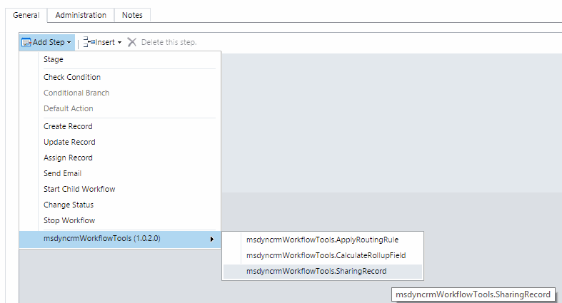

This Workflow Action, could be used to Share a record to a User or Team.
Firs of all, you have to select the Action Step:

And then, fill all the Parameters:

The Overide Permissions, removes all the previous privilege shared.
You can select a user or Team (or both).
Then you can select each of the privileges to be shared.

Note: The Record URL, is a standard feature of Dynamics CRM, taht contains the full URL of a record. In this URL you have the entity type, and the record GUID. Right now this is the only way we have to pass a "Dynamic" EntityReference (with not hard coding an entity type) to Workflows Activities. If you pass this string URL as a parameter, in the Workflow Activity you can retrieve this entity Reference.
