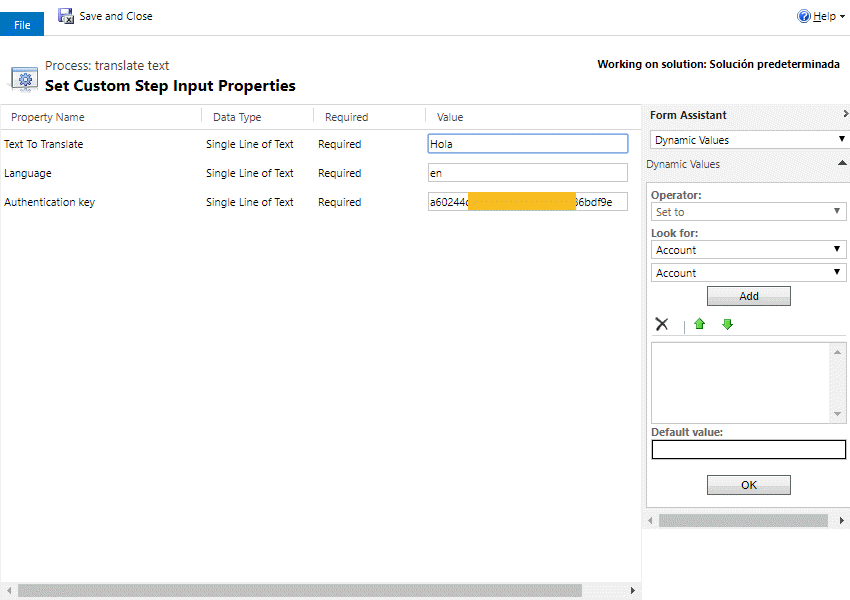
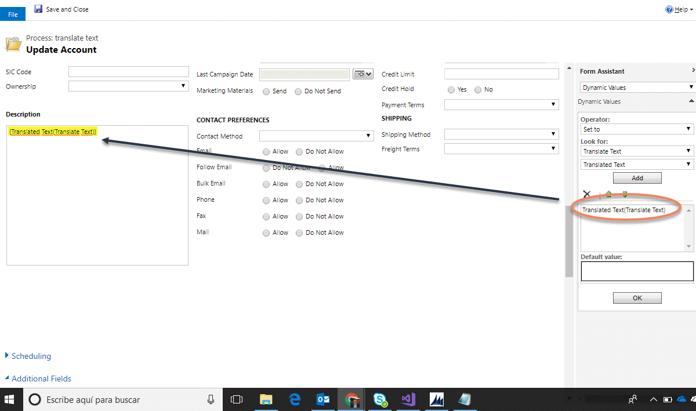
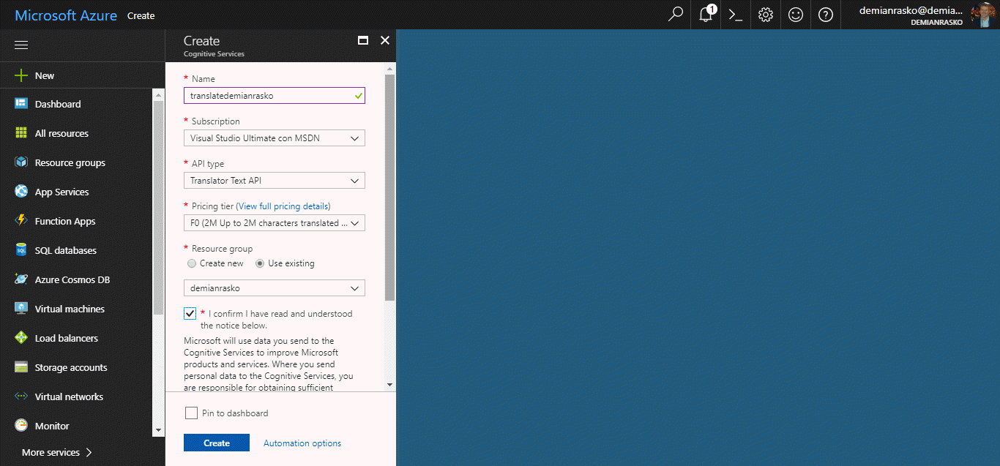
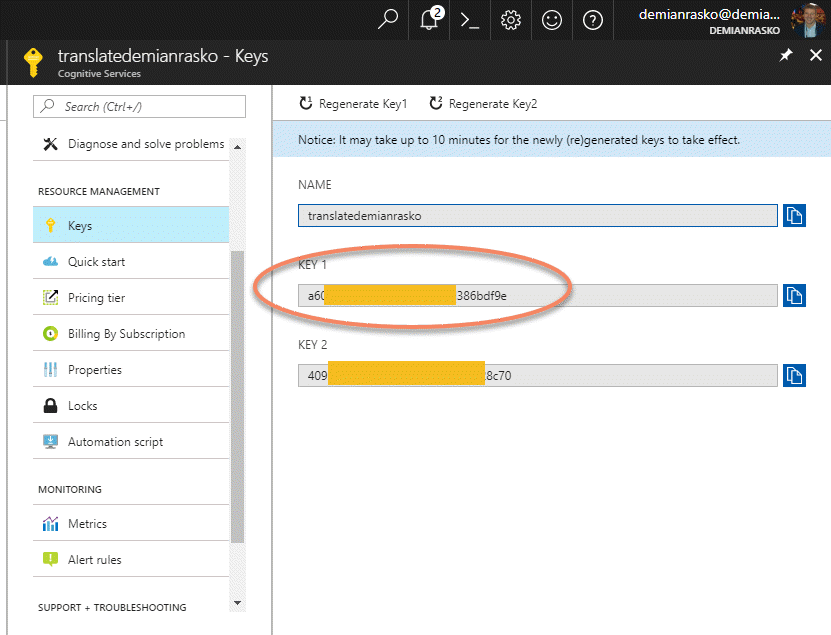

This Action allows you to translate a text to any language.
Supported Languages are listed here: https://docs.microsoft.com/en-us/azure/cognitive-services/translator/languages
For this, I'm using the Translator Text API described here: https://docs.microsoft.com/en-us/azure/cognitive-services/translator/quickstarts/csharp

For using this action, just select it from the list:

And then, introduce the parameters:

Finally you have three output parameter, with the text:

For getting the Autorization key, you need to create in your Azure Environment, a Cognitive service with API Type "Translator Text API" like this one:

and retrieve the key from here:

