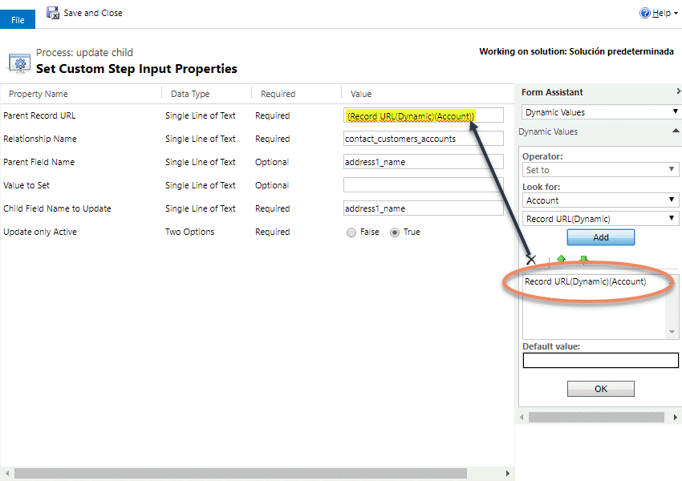

The Update Child Records allows you to update multiple child records from a parent record. You can update one field of the Childs based on a dynamic value or a parent field, or based on string value.

For using this action you need to select the action:

Then fill all the parameters:

The parameters are:
* **Parent Record URL**: the URL of the parent record (recover dynamic on the workflow)
* **Relationship Name**: The name of the relationship between the parent and child entity
* **Parent Field Name**: (optional) the schema name of the field in the parent entity 
* **Value to Set**: (optional) the string value to be set (if the previuos one is empty)
* **Child Field Name to Update**: The destination field name on the child entity
* **Update Only Active**: True: updates only active records, False: update all records

NOTES:
1) The relationship must be a one-to-many relationship that exists in the environment, from the parent table to the child table.
2) When copying a parent field, the parent and child fields should be the same type.
3) **Value to Set** is converted to the child field's type: whole numbers, decimals, floating point numbers and currency ("12.5", always with a "." decimal point), dates ("2026-10-05"), choices, status and status reason (the option's number, e.g. "2"), and lookups (a record's GUID, only for lookups that point to a single table). Leave it empty to clear the field.
4) For Yes/No fields use "1" or "true" for Yes; anything else is No.
5) Every child record is updated, including when there are more than 5,000.
6) Product properties (dynamicpropertyinstance) can't be updated with this action; the step fails with a message saying so.
